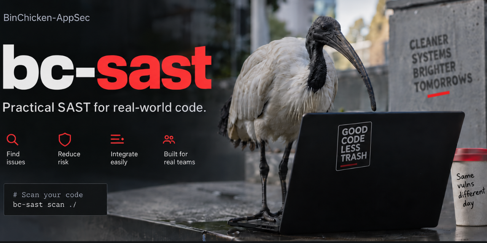

<p align="center">
  
</p>

# BC Agentic SAST Harness

An agentic SAST (static application security testing) scanner, written in
Rust. It points an LLM at a repository (or a PR diff), has it map the
codebase, build a threat model, hunt for vulnerabilities, adversarially
verify its own findings, rank severity, and optionally propose and grade
remediations. It then emits a Markdown report, a SARIF file, and
(optionally) GitHub PR review comments with native suggested-fix diffs.

Ported from `vvaharness`, Visa's Apache-2.0 Python agentic SAST harness
(Copyright 2026 Visa, Inc.). This is a Rust reimplementation, not a fork:
it contains no vvaharness Python backend. Authorized target-test commands
can run Python or other target languages inside a configured container. It
does carry over a substantial amount of vvaharness's own authored text,
which remains Copyright 2026 Visa, Inc. under Apache-2.0: the researcher
hints transcribed byte-for-byte into `bc-stage-s4`'s `hints.rs`, the
pipeline stages' LLM prompt text, and shorter passages in roughly two
dozen further files, each of which says so in its own header. `NOTICE` is
the full attribution and lists them. The pipeline stages, prompts and
scoring logic adapt the original harness and include local extensions. The
implementation uses a gateway-mediated `LlmClient` trait, a confined
`ToolExecutor`, and separate crates for stages, tools and shared logic.

## Status

The package version is **1.1.0**.

Two limits are worth knowing before you rely on target testing or remote
delivery. The container execution path used by target testing has not been
observed running against a live Docker engine; its authorization, refusal
and classification paths are covered by tests. Remote push, CI upload and
native Windows runs are likewise unvalidated. See
[implementation notes](docs/implementation-notes.md) and the
[changelog](CHANGELOG.md), which states the limits of each capability
where that capability is described.

```mermaid
flowchart LR
    subgraph Scan["Phase 1 · Scan (S0-S9)"]
        direction LR
        S0[Static seed] --> S1[Preprocess]
        S1 --> S2[Threat model]
        S2 --> S3[Decompose]
        S3 --> S4[Deep-dive]
        S4 --> S5[Prefilter]
        S5 --> S6[Verify]
        S6 --> S7[Dedup]
        S7 --> S8[Chain analysis]
        S8 --> Report["S9 · Reporting<br/>Markdown + SARIF + CSV"]
    end
    Report -.full scan with target testing.-> Tests["Discover existing tests<br/>Generate and review missing coverage"]
    Tests --> S10
    Report -.optional.-> S10["Phase 2 · Remediate (S10)<br/>policy-gated patch + diff capture/revert"]
    S10 -.optional.-> S11["Phase 3 · Validate (S11)<br/>2-or-3-persona LLM panel grades the fix"]
    S11 --> Delivery["Delivery gates<br/>combined patch, new branch, or source ZIP"]
    Delivery -.optional.-> PR[GitHub PR comments / suggested-fix diffs]
```



Step 0 is a deterministic, LLM-free tree-sitter seed plane and is **on by
default** (`step0.enabled: true`): it extracts framework routes, auth
guards, unsafe sinks and seed taint paths before any model call, and every
later stage reads them. It walks exactly the scope step 1 walks: the
orchestrator copies `step1`'s exclusion and walk settings onto it.
Configuring exclusions once under `step1` therefore bounds both.

Remediation runs an agentic edit loop; S11 provides a separate model review.
Target testing can discover existing suites, propose missing tests, and,
with a vetted execution profile, compare baseline and patched results.
Generated tests, model review, and executed tests are recorded separately.
Passing checks do not establish complete security or functional correctness.

Historical release checks and comparisons are documented in
[`CHANGELOG.md`](CHANGELOG.md), [comparison](docs/comparison.md), and
[GitHub Action notes](docs/github-action.md). They do not validate the
unreleased features above. The project's coverage gates are described in
[coverage exceptions](docs/coverage-exceptions.md); full workspace coverage
was not rerun for these changes.

The [control mapping](docs/compliance/CONTROL_MAPPING.md) and
[agent security review](docs/compliance/AI_AGENT_SECURITY_REVIEW.md) describe
this harness's own security posture. Framework scanning presets instead
provide guidance and requirement mappings for target findings. Neither a
clean scan nor a mapped finding establishes framework compliance.

A full scan can automatically publish provider assessments with
`--provider-writeback apply`, after S9 reporting and before optional
remediation. Native API updates use a build-owned policy, private journals, state checks,
and read-back. No per-finding human approval is
required. Live provider account validation remains outstanding.
Publication journals use the built-in application state location. Ephemeral
containers require no additional state flag or persistent volume.
See [provider write-back](docs/provider-writeback.md) for commands and limits.

## Building

```sh
cargo build --release -p bc-cli
```

Produces a `bc-sast` binary. Requires network access to whatever LLM
gateway/endpoint you configure; there is no bundled model and no offline
mode.

## Running

```sh
bc-sast --repo <path> \
    --gateway-base-url https://api.openai.com/v1 \
    --gateway-api-key <key> \
    --dialect openai \
    --model <model-id>
```

Writes `<repo>/security-scan/report.md`, `report.sarif`, `report.csv` and
`findings.json` by default. No flag asks for them: every scan writes what
it produced. Move the whole set with `--out-dir`, or one format at a time
with `--out-md`/`--out-sarif`/`--out-csv`/`--out-findings-json`.
`--dialect anthropic` speaks the
Anthropic Messages API shape instead; either dialect can point at a direct
provider endpoint or an OpenAI/Anthropic-compatible AI gateway (Bifrost,
Portkey, etc). See `bc-sast --help` for the full flag list, including
`--remediate`, `--config`, `--diff-scope` plus `--pr-comments` (scope a
scan to a pull request and comment on it, both opt-in),
`--max-tokens`/`--max-scan-seconds` (spend caps), and
`-i`/`--interactive` (a terminal picker for remediation).

`--model` defaults to `gpt-5.6-luna`, a reasoning model, which the
default `--openai-api auto` reaches over the OpenAI Responses API.
`--reasoning-effort` sets every role's effort tier, `--no-cache-markers`
switches prompt-cache markers off, and `--doctor` prints what each
configured model accepts (add `--cache-probe` for a live, token-spending
cache check). A retired model id stops the run before any token is spent
unless `--allow-unsupported-model` is passed. See
[`docs/llm-transport.md`](docs/llm-transport.md).

## Frameworks, testing and delivery

Add these options to the configured scan command above:

| Purpose | Options |
|---|---|
| Apply built-in framework guidance and mappings | `--scan-framework asvs` (also `pci-dss`, `ssdf`, or `soc2`; repeat to combine). |
| Discover target tests without generation | `--remediate --target-tests discover`. |
| Generate or extend target tests | `--remediate --target-tests unit`, `integration`, or `comprehensive`. A bare `--target-tests` selects `comprehensive`; `e2e` and `generate` are compatible names for that scope. |
| Create, complete, repair or relocate the target's API descriptions (OpenAPI/Swagger, GraphQL SDL, AsyncAPI, OpenRPC, SOAP WSDL); repair OData CSDL; check Protocol Buffers, RAML and API Blueprint | On by default with `--target-tests integration` or wider when the target has API evidence or a description; `--api-spec off` skips it and `--api-spec-formats` narrows it. Static only: no request reaches the application or a broker, and no import is fetched. |
| Produce reports and stop | `--stop-after s9`. S8 finishes analysis; S9 renders reports. `--stop-after s8` does not publish report files. |
| Commit and push accepted changes on one new branch | `--remediate --remediation-delivery branch --delivery-remote origin --delivery-branch bc-sast/fixes-run-123`. |
| Package updated source and tests for CI | `--remediate --remediation-delivery zip`. Writes `security-scan/remediated-source.zip`. |

Target testing and branch/ZIP delivery require a full scan followed by
remediation, with no diff scope, prior-report remediation, resume, dry run,
interactive mode, or early stop. Branch and ZIP delivery work with or
without target-test generation. The default delivery remains a combined
patch for review and manual application.

Existing suites are inspected before missing tests are proposed. Accepted
tests follow the target's layout and travel with production fixes in the
combined patch, new branch, or ZIP. The original checkout is not edited by
branch or ZIP delivery. Branch mode requires a clean Git checkout and
explicitly authorizes a new commit and push; existing branches are not
replaced. ZIP mode works from an isolated source copy without Git. CI must
upload the ZIP to make it downloadable; the Docker action exposes
`remediation-delivery: zip`, and the delivery guide supplies an upload step.

Testing levels describe requested scope, not achieved coverage. The opt-in
`discovered-offline` profile authorizes discovered commands that match its
build-owned ecosystem allowlists and pinned images, and installs the
target's own lockfile-pinned dependencies first, in the run's only
networked container. Other shipped profiles do not execute target code.
Execution needs preloaded local images. Framework and testing policies are
compiled into the binary; change their source files and rebuild to alter
them. Runtime replacement policy files are rejected.

See [built-in policies](docs/built-in-policies.md),
[target testing](docs/target-testing.md), and
[remediation delivery](docs/remediation-delivery.md) for restrictions,
validation states, source locations, and examples.

## Deploying it

For one-off local runs the above is all you need. To run this across an
organization, build the image once, publish it to a registry you control,
and pull it from each target repository's pull-request workflow.
[`docs/deployment.md`](docs/deployment.md) has the four steps, with
copy-pasteable workflow snippets for both self-hosted and hosted runners.
`docs/github-action.md` covers the alternative: a container action that
builds from this repo's `Dockerfile` on the consumer's own runner, no
registry needed, at the cost of that build on every run.

The runtime image is a minimal nonroot (uid 65532) Wolfi base with `git`
installed, about 135MB, with both build stages pinned by digest. It ships
a shell and a `git` deliberately: the `step_remediate.verify_command`
safety gate runs the operator's own build or test command under `sh -c`
before accepting an agent's fix, and `git` backs the revert backstop,
worktree isolation and HEAD-sha detection. Model tools do not expose a shell. Operator-configured commands can still
execute target-controlled code; the legacy host verification command is
rejected for target testing and branch/ZIP delivery.
Its tool allowlist is Read, Glob, Grep, Edit and Write, with no shell
tool and no tool that spawns a process, so the posture is "a shell exists
and the agent cannot reach it" rather than "no shell exists". The image
ships no compilers, test runners or language package managers, so a
`verify_command` for your project means building a thin image on top of
this one that adds them. `docs/deployment.md` has the example.

## Differences from the Python harness

Most of `vvaharness` is ported behavior-for-behavior. These pieces are
deliberately **not** ported, each for a reason recorded in the code:

- **The Claude Code CLI subprocess backend.** Python selects a backend per
  role (`via: cli|sdk|openai`). Every call here goes through one
  gateway-mediated `LlmClient` with two wire dialects instead, so there is
  no subprocess backend, no per-role backend selection, and no
  `--config` profile system to choose between them. `bc-stage-s4`'s
  `_effective_runs` backend-detection branches are dropped with it; the
  rest of `_effective_runs` is ported.
- **`max_budget_usd`.** In Python this was never a harness feature, it was
  a passthrough to Anthropic's own tooling. `claude_cli.py` forwards
  `--max-budget-usd` to the `claude` subprocess when the installed binary
  advertises the flag, and `agent_sdk.py` sets it on a Claude Agent SDK
  session; those two backends do the enforcing, and neither is ported
  here. The two backends this port's dialects correspond to ignore it
  outright, one of them with the literal comment "accepted for parity;
  unused". Python computes a dollar figure nowhere and ships no price
  table, so there is nothing behind the knob to port. This port therefore
  does not ship it as a default either. A config that still sets it loads
  and warns. The spend knobs here are `--max-tokens` and
  `--max-scan-seconds`, which are enforced (see below).
- **`--group-by-app`** in batch mode. Python's version changes
  scan scope, not a reporting grouping: every repo sharing an
  application id is staged under one directory and scanned as a single
  combined tree, so cross-repo call-graph edges are visible. Approximating
  it by grouping per-repo reports afterwards would misdescribe what the
  flag does, so it is left unimplemented rather than faked.

Two shipped defaults also differ on purpose:

- **Step 0.** Python's `_STEP_DEFAULTS` ships `step0.enabled: false`; its
  `default.yaml`/`taint.yaml` profiles turn it on and drive it through the
  LLM annotator (`models.callgraph_creation`). This port ships
  `step0.enabled: true` at the defaults layer with
  `callgraph_detection: rules`, which is deterministic and zero-token.
  `llm` mode
  exists and is opt-in.
- **`step1.call_graph`.** Python ships `regex`; this port's
  `Step1Config::new()` defaults to the tree-sitter backend, which yields
  real `def_spans` and exact end lines that several downstream stages here
  were built against. Set `step1.call_graph: regex` for Python's
  behavior.

`docs/parity-harness.md` covers what *is* cross-checked against the real
Python source, and `docs/configuration.md`'s key reference marks every
carried-but-dead config key.

## Known limitations

- **Model-dependent results vary between runs.** Temperature and seed do
  not guarantee identical findings. Historical measurements in
  [comparison](docs/comparison.md) do not establish repeatability for this
  working tree. See [configuration](docs/configuration.md) for controls.
- **External scanner integrations are optional and unverified here.**
  Semgrep, Checkmarx and other provider tenants are unavailable in this
  environment. Their absence does not prevent the core model-driven scan
  or built-in framework selection. See
  [third-party ingestion](docs/third-party-ingestion.md).
  `--provider-writeback plan` writes proposals without vendor changes.
  `--provider-writeback apply` automatically publishes eligible full-scan
  assessments using native provider scope, with per-origin results and
  durable journals. See
  [provider write-back](docs/provider-writeback.md) for commands and limits.
- **Target assurance is bounded.** Unrecognized layouts, inline tests,
  missing contracts or services, and generation budgets leave gaps.
  Only `discovered-offline` ships execution authorization. A package with
  no lockfile the build can install from is refused rather than tested
  against no dependencies. The executor uses Linux containers, not native
  Windows application testing.
- **Delivery needs operational validation.** Local synthetic tests cover
  branch and ZIP mechanics. Live authentication, CI upload, container test
  execution, and Windows-specific paths remain untested for these changes.

## Workspace layout

The workspace groups crates by pure logic, I/O boundaries, pipeline stages,
orchestration, and CLI integration. Detection uses `bc-stage-s0` through
`bc-stage-s8`; S9 is implemented in `bc-orchestrator::reporting`, using the
existing renderers. S10 and S11 have separate stage crates.
`bc-target-tests` performs static test discovery and `bc-api-spec` holds
the pure API specification logic; the CLI owns test orchestration,
execution policy, and delivery.

## Verifying

```sh
cargo test --workspace
cargo clippy --workspace --all-targets -- -D warnings
cargo fmt --all --check
cargo deny check advisories bans licenses sources
```

Coverage. The workspace-wide gate excludes `bc-parity-tests` (it needs a
Python venv, so a coverage number there is meaningless. See
`docs/parity-harness.md`.) and the eleven crates that carry their own
threshold; each of those is then measured separately. The authoritative
list of invocations and thresholds is `.github/workflows/ci.yml`, with the
rationale for every exception in `docs/coverage-exceptions.md`:

```sh
cargo llvm-cov --workspace \
  --exclude bc-cli --exclude bc-checkpoint --exclude bc-callgraph \
  --exclude bc-repo-analysis --exclude bc-stage-s0 --exclude bc-stage-s1 \
  --exclude bc-validation-scoring --exclude bc-thirdparty-api \
  --exclude bc-diffcapture --exclude bc-sandbox-tools \
  --exclude bc-orchestrator --exclude bc-parity-tests \
  --ignore-filename-regex 'bc-interactive/src/blocking_io\.rs' \
  --fail-under-lines 100 --fail-under-functions 100

# then each excluded crate at its own documented threshold, e.g.
cargo llvm-cov -p bc-cli \
  --ignore-filename-regex 'bc-interactive/src/blocking_io\.rs' \
  --fail-under-lines 99.4 --fail-under-functions 99.5
```

## Docs

See [`docs/README.md`](docs/README.md) for the full index. Highlights:

- `docs/solution-design.md`: the high-level design, with Mermaid diagrams
  and an editable `docs/diagrams/solution-design.drawio` copy.
- `docs/USER_GUIDE.md`: CLI reference (modes, flags, dialects, outputs).
- `docs/deployment.md`: the recommended way to run this across an
  organization. Build once, publish the image to your own registry, then
  pull it from each target repo's pull-request workflow.
- `docs/architecture.md`: crate-tier map and pipeline data flow.
- `docs/comparison.md`: the measured comparison against the Python harness
  this port replaces, with the caveats that make it fair.
- `docs/diagrams/`: pipeline, seed plane, guard gate, finding lifecycle,
  crate map and deployment diagrams (Mermaid, rendered by GitHub).
- `docs/configuration.md`: the optional `--config` YAML file.
- `docs/remediation.md` / `docs/validation.md`: stages S10 and S11.
- `docs/compliance/`: control mapping, AI-agent security review, and a
  dedicated MITRE ATLAS threat model.
- `CHANGELOG.md`: release notes.
- `SECURITY.md`: vulnerability reporting, via a private advisory.
- `CONTRIBUTING.md`: how to build, what a change has to clear, and the
  house style. `CODE_OF_CONDUCT.md` covers conduct and reporting;
  `docs/ISSUE_TEMPLATE.md` and `docs/PULL_REQUEST_TEMPLATE.md` are what
  GitHub prefills.

Deployment infrastructure is not published here. The registry half of
`docs/deployment.md`: one team's OIDC-authenticated CI role and private
image registry. It is not the way to deploy this, and it is not part of
the published source.

## License

Apache-2.0. See `LICENSE` and `NOTICE`.
