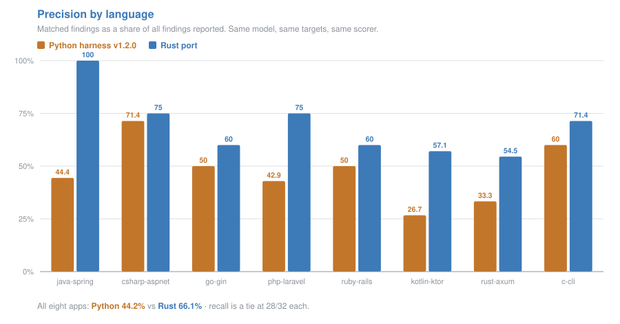
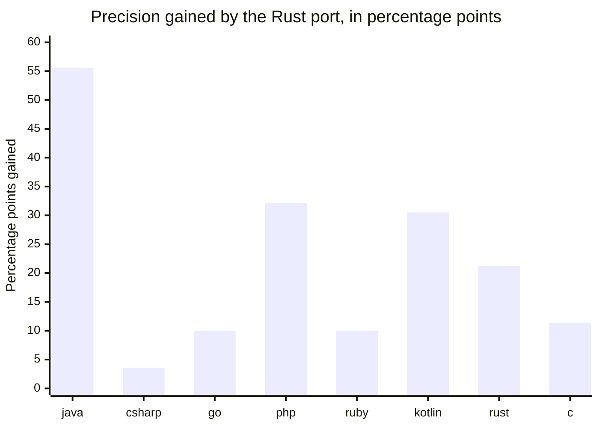
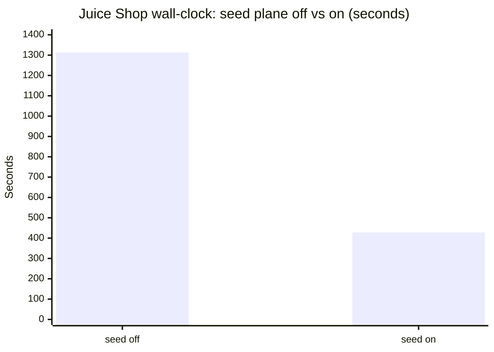
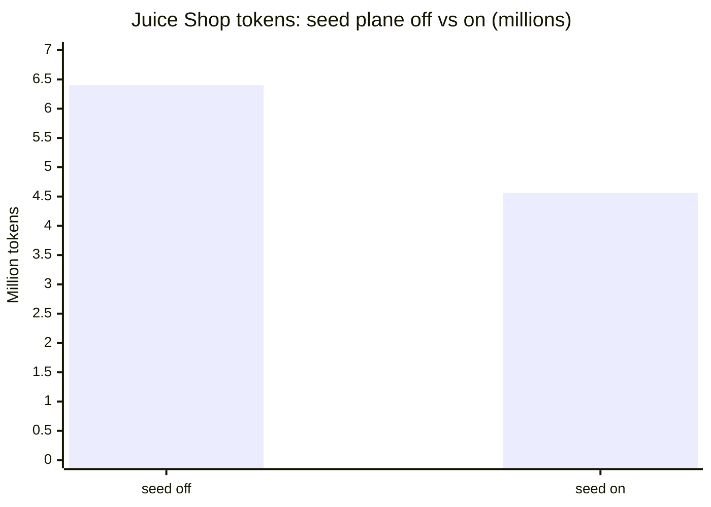
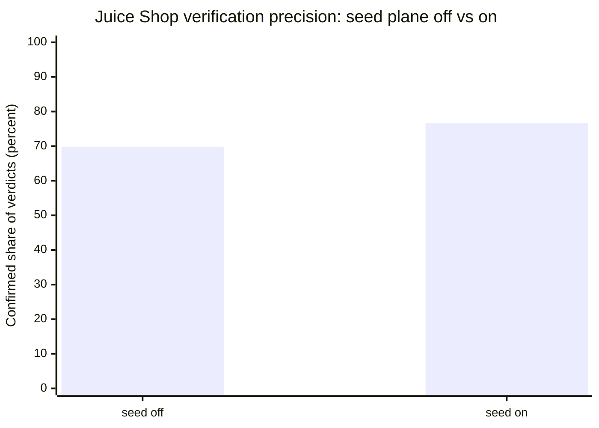

# bc-sast vs. the Python harness it was ported from

`bc-sast` is a Rust port of
[`visa-vulnerability-agentic-harness`](https://github.com/visa/visa-vulnerability-agentic-harness)
("VVAH"). This document is the head-to-head measurement between the two,
taken on 2026-09-06 and 2026-09-07.

The short version: **detection is a tie, and that is the expected result.**
Both scanners drive the same model with the same prompt lineage, so both
find the same seeded vulnerabilities, 28 of 32 each. What differs is
everything around the detection: how many *wrong* things get reported
alongside the right ones, whether the same input produces the same output
twice, what the run does when the provider says no, and what you can
actually do with the result. Those are the axes this document measures.

---

## Contents

- [Methodology](#methodology)
- [Results: the polyglot test bed](#results-the-polyglot-test-bed)
- [Results: OWASP Juice Shop backend](#results-owasp-juice-shop-backend)
- [Results: a multi-file Flask pull request](#results-a-multi-file-flask-pull-request)
- [Cost, and why it is only indicative](#cost-and-why-it-is-only-indicative)
- [What each one does better](#what-each-one-does-better)
- [Behavioral differences, verified against the code](#behavioral-differences-verified-against-the-code)
- [Deliberately not ported](#deliberately-not-ported)
- [Limitations of this comparison](#limitations-of-this-comparison)
- [Reproducing these numbers](#reproducing-these-numbers)

---

## Methodology

### The two scanners

|  | Rust | Python |
|---|---|---|
| Name | `bc-sast` (this repository) | `visa-vulnerability-agentic-harness` v1.2.0 |
| Invocation | `bc-sast --repo ... --model gpt-4o --dialect openai` | `vvaharness scan --repo ... --config ...` |
| Configuration in the runs | CLI flags | shipped `default.yaml` profile **verbatim**, plus a `config.local.yaml` overlay (the harness's own documented, logged override mechanism) |

The Python side was run as close to stock as it can be run. The overlay is
confined to what the comparison itself requires:

1. **Model routing.** The shipped profile runs every detection role as
   `via: cli` (a Claude Code subprocess), which would have compared two
   scanners on two different models. Every role was repointed at the same
   OpenAI model the Rust runs use, at `temperature: 0`.
2. **Output-token caps.** The profile sizes its per-step `max_tokens` at
   `64000`, which is an Anthropic-shaped number. `gpt-4o` accepts at most
   16384 completion tokens and the harness forwards the value straight
   through, so *every* call returned HTTP 400 and the scan found nothing
   at all. The caps were lowered to 16000. (This is itself a finding:
   see [Behavioral differences](#behavioral-differences-verified-against-the-code).)
3. **S11 validation off**, and its model panel repointed at OpenAI anyway,
   because the startup preflight probes every role in `models.*` whether
   or not its stage is enabled. S11 has no counterpart in the Rust runs.

Everything else keeps the harness default, including its S0 static seed
plane, which `default.yaml` enables.

### Held equal

- **Same model:** `gpt-4o`, `temperature 0`, same OpenAI endpoint.
- **Same targets:** the same checkouts, at the same commits.
- **Same scope:** the same `step1` exclude list on both sides. Supplying it
  on the Python side also disables the profile's AI auto-exclude survey, so
  the scope is deterministic and costs no extra model call, matching the
  Rust runs' fixed exclude list.
- **Same scorer, same ground truth:** `polyglot/score.py` in the demo
  repository, run against the identical checked-in `ground-truth.json`.
- **Ground truth is hidden from both.** Each app's `ground-truth.json` is
  moved out of the scan target before the scan starts and moved back
  afterwards. Neither scanner ever sees the answers.
- **Both runs happen in GitHub Actions**, on `ubuntu-latest`, one app per
  run.

### Ground truth

Each polyglot app ships a `ground-truth.json` holding:

- `expected`: one entry per seeded vulnerability, carrying its id, CWE, the
  **exact** sink file and line, the **exact** source file and line, a title,
  and `reachable_from_unauth`.
- `negative_controls`: the safe counterpart of a seeded shape (a bound
  placeholder, a bounded copy), with the line it lives on and why it is safe.
- `routes`: method, path, handler, and whether the route carries an auth
  guard.

Line numbers were generated mechanically from markers in the source, so
they are exact rather than approximate.

### The scorer, and what "precision" means here

A finding **matches** an expected item when *both* hold:

1. **The CWE agrees**: the finding's CWE equals the expected CWE, or sits
   in the same family. The scorer carries eleven explicit families (SQL/NoSQL
   injection; command injection; path traversal; code injection and dynamic
   include; deserialization; XXE; SSRF; memory bounds; use-after-free and
   double-free; format string; authorization), so a scanner that says
   CWE-787 where the truth says CWE-125 has still found the same bug.
2. **The location agrees**: one of the finding's locations names the
   expected item's sink *or* source file, with the expected line inside
   `line_start - 5 .. line_end + 5`. A finding's locations are its top-level
   `file` plus `line_start`/`line_end`, and also whatever its `source_ref` /
   `sink_ref` fields say.

Then:

```
recall    = seeded flows found / seeded flows            (out of 4 per app)
precision = matched findings / ALL findings reported
controls  = negative controls wrongly reported           (out of 1 per app)
```

> [!IMPORTANT]
> **"Precision" here is stricter than the word usually implies.** The
> denominator is *every* finding the scanner reported. A finding that is a
> perfectly real vulnerability, correctly located, but simply not one of the
> four the app's author seeded and wrote down, still counts against
> precision. It is better read as **"share of output that lands on a
> known-planted flaw"** than as "share of output that is true". Both
> scanners are penalized the same way by the same rule, which is what makes
> the comparison fair, but neither number is a false-positive rate.

Negative controls are scored the other way round and **without regard to
CWE**: any finding landing within ±5 lines of a control counts against it.
Some apps deliberately keep the safe query a few lines from the seeded one
(discriminating between them in the same file is the point), so a finding is
credited to whichever line it is actually nearer. Only a report *strictly*
closer to the safe line is a false positive; ties go to the expected item.

The scorer always exits 0. It measures; it does not gate.

### Sample sizes, and the variance caveat

> [!WARNING]
> **These are single runs of a stochastic system.** One run per app per
> scanner for the polyglot bed; a small handful of runs for Juice Shop and
> the Flask PR. Every number below carries run-to-run model variance that is
> not quantified here, because quantifying it properly would take tens of
> runs per cell.
>
> The size of that variance is not hypothetical. **The same scanner, at
> `temperature 0`, over the identical `c-cli` source, scored 2/4 and 4/4 on
> two separate samples.** That is a two-point swing in recall on a
> four-item denominator, from nothing but sampling noise.
>
> Read the per-app rows as indicative and the totals as the signal.
> Differences of one or two findings in a single row mean nothing. The
> ~22-point aggregate precision gap, reproduced in the same direction in
> eight of eight languages, is the part that survives the noise.

---

## Results: the polyglot test bed

Eight small applications, one per language, each with the same skeleton:
**4 seeded cross-file vulnerabilities** (user input read in a route handler,
passed through a helper in a second file, reaching a sink in a third),
**1 parameterized negative control** (the same shape done safely), and, for
the seven with an HTTP surface, one unauthenticated route plus at least one
behind a framework-idiomatic auth guard. `c-cli` is a command-line tool and
has no routes.

Three vulnerability classes are common to all eight (SQL injection, command
injection, path traversal), plus one idiomatic to each language. So a gap in
the table is a gap in a language's coverage, not a difference in the sample
code.

### The table

| app | Python recall | Python precision | Python controls | Rust recall | Rust precision | Rust controls |
|---|---|---|---|---|---|---|
| `java-spring` | 4/4 | 44.4% (4/9) | 0/1 | 4/4 | **100%** (4/4) | 0/1 |
| `csharp-aspnet` | 4/4 | 71.4% (5/7) | **1/1** | 3/4 † | 75.0% (3/4) | 0/1 |
| `go-gin` | 4/4 | 50.0% (6/12) | 0/1 | 3/4 † | 60.0% (6/10) | 0/1 |
| `php-laravel` | 4/4 | 42.9% (6/14) | 0/1 | 4/4 | 75.0% (6/8) | 0/1 |
| `ruby-rails` | 3/4 | 50.0% (3/6) | 0/1 | 3/4 | 60.0% (3/5) | 0/1 |
| `kotlin-ktor` | 3/4 | 26.7% (4/15) | **1/1** | 4/4 | 57.1% (4/7) | 0/1 |
| `rust-axum` | 3/4 | 33.3% (3/9) | 0/1 | 4/4 | 54.5% (6/11) | **1/1** |
| `c-cli` | 3/4 | 60.0% (3/5) | 0/1 | 3/4 † | 71.4% (5/7) | 0/1 |
| **total** | **28/32** | **44.2%** (34/77) ‡ | **2** | **28/32** | **66.1%** (37/56) | **1** |

**† The three Rust `3/4` rows are not the same kind of miss as Python's.**
In all three cases the flaw *was* detected and reported; the report simply
did not satisfy the scorer's matching rule:

- **`csharp-aspnet`**: the SQL injection was anchored at the **method
  header** rather than at the `SqlCommand` line, landing outside the ±5-line
  window.
- **`go-gin`**: the SSRF was filed as **CWE-20 / CWE-285** rather than
  CWE-918. Those are not in the scorer's SSRF family, so the CWE test failed.
- **`c-cli`**: the use-after-free was anchored at the **`free()` site**
  rather than at the later read that the ground truth pins as the sink.
  Fixed after this run, and re-measured: see "After the fixes" below.


### After the fixes

Two of the limitations behind the table above were closed after it was
measured, and the two affected apps were re-run on 2026-09-07 with the
same model, the same seed and the same scorer. Everything else in this
document is the original measurement and has not been re-run, so these two
rows are **not** comparable with the Python column beside them: they are a
newer scanner against the same ground truth.

| app | before | after |
|---|---|---|
| `c-cli` recall | 3/4 | **4/4** |
| `c-cli` precision | 66.7% (4/6) | 50.0% (4/8) |
| `kotlin-ktor` recall | 4/4 | 4/4 |
| `kotlin-ktor` precision | 55.6% (5/9) | **87.5% (7/8)** |

The `c-cli` use-after-free is now credited, reported as a span across both
the release and the use. That is no longer only asked for: S4's reply
schema states the rule, and `bc-stage-s4::reanchor` then enforces it on
every C/C++ temporal finding it can read deterministically, rewriting
`line_start`/`line_end` to span release-to-use and recording the rewrite in
the finding's `reanchored` field. The prompt rule alone was the earlier fix
and was not enough on its own.
Its precision fell in the same run: two more findings that match nothing
in the ground truth, one of which is the format-string bug it *already*
reported, refiled at the same lines under a different CWE. Deduplication
leaves those split on purpose, because two specific CWEs on one range can
be two real bugs, but the cost shows up here.

`kotlin-ktor`'s gain is the route gate finally matching a finding to its
handler by name. The scan log shows five authorization findings dropped
against `authenticate("auth-session")` by name, while the one
open route was left alone and refuted by the verifier instead.

Both are single samples against a model with roughly 55-60% run-to-run
identity overlap, so treat the direction as evidence and the exact figures
as one draw.

Python's four misses are absences: nothing was reported for those flows at
all. This asymmetry is worth stating plainly because it cuts *against* the
convenient reading: **the recall tie flatters Python slightly.** Three of
the Rust port's four "misses" are anchoring and taxonomy disagreements with
the scorer, and a human triaging the report would have found the bug.

**‡ One bookkeeping discrepancy, disclosed.** The run notes record the
Python aggregate precision as 33/77 (42.9%); the eight per-app rows sum to
34/77 (44.2%). Every individual row is internally consistent (each stated
percentage matches its own fraction), so the table uses the row sum and the
higher figure, which is the one more favorable to Python. The gap to the
Rust port's 66.1% is ~22 points either way.

### Precision, per language



<details>
<summary>The same chart as a Mermaid source block</summary>

Mermaid's `xychart-beta` overlays two bar series rather than grouping them,
and supports no legend, which is why the chart above is a generated SVG
instead. In this version the back (taller) series is the Rust port and the
front (shorter) series is the Python harness. That is legible only because
the Rust port is higher in eight of eight languages, so the front series
never hides the back one.

```mermaid
xychart-beta
    title "Precision by language: Rust port at back, Python harness in front"
    x-axis ["java", "csharp", "go", "php", "ruby", "kotlin", "rust", "c"]
    y-axis "Precision (percent)" 0 --> 100
    bar [100.0, 75.0, 60.0, 75.0, 60.0, 57.1, 54.5, 71.4]
    bar [44.4, 71.4, 50.0, 42.9, 50.0, 26.7, 33.3, 60.0]
```



</details>

The same data as a single unambiguous series, showing how many percentage
points of precision the port gains over the harness in each language:



### Where the difference actually comes from

Recall is equal, so the entire precision gap is in the **denominator**:
how much unmatched output each scanner emits alongside the findings that hit
ground truth.

```mermaid
xychart-beta
    title "Findings reported that matched no ground-truth item (lower is better)"
    x-axis ["java", "csharp", "go", "php", "ruby", "kotlin", "rust", "c"]
    y-axis "Unmatched findings" 0 --> 12
    bar [5, 2, 6, 8, 3, 11, 6, 2]
    bar [0, 1, 4, 2, 2, 3, 5, 2]
```



Back series: Python (43 unmatched findings across the eight apps). Front
series: the Rust port (19). Same model, same prompts, same targets, same
seeded bugs found: **less than half the unmatched output.**

Both scanners reported 32 findings' worth of true positives on the same 32
seeded flows. Python needed **77 findings** to say it; the Rust port needed
**56**. On `java-spring` the port reported exactly four findings and all four
were the four seeded flows.

Negative controls tell the same story from the other end: Python tripped 2
of 8, the port tripped 1 of 8. Neither is clean, and the port's one
violation (`rust-axum`) is a real regression against Python's clean sheet on
that app.

---

## Results: OWASP Juice Shop backend

A real application rather than a test bed: 199 backend files, 150 of them in
scope after exclusions. **These are Rust-only runs** (back-to-back, on the
same commit family), measuring what the S0 seed plane is worth. There is no
Python column here.

| | seed plane **off** | seed plane **on**, correct scope |
|---|---|---|
| wall-clock | 1313 s | **428 s** |
| tokens | 6.40M | **4.56M** |
| raw candidates | 277 | 141 |
| confirmed | 171 | 98 |
| refuted | 74 | 30 |
| verification precision | 69.8% | **76.6%** |
| verifier errors | n/a | **0** |
| rate-limit retries | n/a | **0** |
| budget outcome | **cap tripped before S7** | completed |
| canonical challenge files hit | 14/15 | 14/15 |

Verification precision here is `confirmed / (confirmed + refuted)`, the
share of what the detection stage proposed that survived the verifier. It is
a different measurement from the polyglot bed's precision, which is scored
against hand-written ground truth. In the seed-on run every raw candidate
is accounted for: 98 confirmed, 30 refuted, 8 collapsed as duplicates
before verification, 4 excluded by the deterministic S5 gates (three
template auto-escape, one test path) and 1 left unconfirmed by the
verifier. In the seed-off run the remainder never reached a verdict,
which is what the budget cap tripping before S7 means.







**3.1x faster, 29% fewer tokens, 6.8 points more precise, and it finished
instead of hitting the cap**, while hitting the same 14 of 15 canonical
challenge files. The seed plane is not a detection aid so much as a
*targeting* aid: it spends static analysis to avoid spending model calls.

See [`diagrams/seed-plane.md`](diagrams/seed-plane.md) for what it actually
computes.

### The fix series that got it there

Juice Shop was scanned repeatedly while defects found in the previous run
were fixed. The measurable deltas, each attributable to one change:

| change | before | after |
|---|---|---|
| `Retry-After` handling on burst 429s | 24 verifications lost to rate limiting | **0** |
| JS/TS event-loop gate | 16 race-condition false positives | **8** |
| template auto-escape gate | n/a | XSS candidates in auto-escaped templates dropped deterministically |
| same-range CWE merge in S7 | 20-23 duplicate findings per run | **collapsed** |

These are the deterministic gates described in
[`diagrams/finding-lifecycle.md`](diagrams/finding-lifecycle.md). None of
them asks the model anything; they are all cheap, repeatable filters applied
to what the model already said.

---

## Results: a multi-file Flask pull request

Seven runs against the same multi-file Flask pull request, exercising the
GitHub Action path end to end.

- The **last two runs kept 5 of 5 finding identities** across runs. The
  same finding got the same id, so a PR comment could be updated rather than
  duplicated.
- **Remediation succeeded 5/5 and 6/6.**
- **PR comments reconciled**: on re-run, existing comments were updated in
  place; no duplicates were posted.

Finding identity stability is the thing that makes the Action usable on a
busy PR. Without it, every push re-posts every comment. See
[`diagrams/finding-lifecycle.md`](diagrams/finding-lifecycle.md) for how the
id is built and matched.

---

## Cost, and why it is only indicative

> [!CAUTION]
> **Read this table with its caveats.** The first Rust column included
> **remediation** (`--remediate --top 2`); the last column is a second
> sample of the same eight apps with remediation off, which is the
> like-for-like comparison. The Python runs stopped *before* remediation
> (`--stop-after s9`) and emit no source/sink references, so even the
> like-for-like column pays for work Python never does: the seed plane's
> evidence packing, the adversarial verifier, and the attack-chain stage.

Total LLM tokens per app:

| app | Python (detection only) | Rust (detection **+ remediation**) | ratio | Rust, remediation off |
|---|---|---|---|---|
| `java-spring` | 137,655 | 223,491 | 1.62x | 208,175 |
| `csharp-aspnet` | 121,512 | 171,059 | 1.41x | 176,821 |
| `go-gin` | 273,225 | 220,831 | **0.81x** | 215,615 |
| `php-laravel` | 104,454 | 177,335 | 1.70x | 178,924 |
| `ruby-rails` | 85,124 | 121,164 | 1.42x | 115,324 |
| `kotlin-ktor` | 111,987 | 242,699 | 2.17x | 268,440 |
| `rust-axum` | 111,342 | 197,127 | 1.77x | 204,921 |
| `c-cli` | 93,638 | 180,227 | 1.92x | 174,223 |
| **total** | **1,038,937** | **1,533,933** | **1.48x** | **1,542,443** (1.48x) |

The one row where the Rust port is cheaper (`go-gin`, at 0.81x) is also
the row where Python emitted its second-largest pile of unmatched findings
(6 of 12). Reporting more costs more.

With remediation off the total is 1,542,443 tokens, the same 1.48x. On
apps this small, remediating the top two findings costs nothing
measurable; the extra spend is the seed plane's evidence packing, the
verifier, and the attack-chain stage, which is where the precision
advantage comes from. That second sample also scored: recall 28/32
(java 4/4, csharp 3/4, go 2/4, php 4/4, ruby 4/4, kotlin 4/4, rust 4/4,
c 3/4), precision 68.6% (35/51), negative controls 0 of 8 wrongly
reported. Against the first sample (28/32, 66.1%, 1 control), the totals
held while three per-app rows moved by one finding in each direction, which
is the run-to-run variance the methodology section warns about.

Note also that the Python side is **unseeded and uncapped**: it has no
`--seed`, no token budget, and no wall-clock cap, so its token totals are
themselves a single sample of a distribution with no ceiling. A runaway
Python scan is stopped only by the workflow's `timeout-minutes`.

---

## What each one does better

### Where the Python harness was credited and the Rust port was not

Stated first, because it is the part a comparison written by the porting
team is most likely to bury.

1. **`csharp-aspnet` recall: Python 4/4, Rust 3/4.** The port anchored the
   SQL injection at the method header, outside the scorer's window. Python
   put it on the sink line. Anchoring precision is a real property and
   Python won that row on the measurement as run.
2. **`go-gin` recall: Python 4/4, Rust 3/4.** Python filed the SSRF as
   CWE-918. The port filed it as CWE-20/285, a defensible reading (the
   handler does fail to validate a URL) that is nonetheless the *less
   useful* classification, and it cost the match.
3. **`c-cli` recall: Python 4/4 on the class, Rust 3/4.** The port anchored
   the use-after-free at the `free()` rather than the later read. Fixed
   and re-measured: see "After the fixes" below.
4. **`rust-axum` negative control: Python 0/1, Rust 1/1.** The port reported
   the safe bound-parameter query as a finding. Python did not. This is a
   plain false positive on the port's side, on the one app where the safe
   path is *statically impossible* to misuse (it takes `&'static str`).
5. **`csharp-aspnet` precision denominator: Python found 5 matching
   findings, the port 3.** Python's extra credited finding is a second
   report hitting the same seeded item. It is noisier, but it did land.
6. **Python is cheaper on `go-gin`** (273,225 vs 220,831 tokens, though
   note this is the direction *against* Python; see the caveat above).

Taken together: the port's anchoring and CWE-assignment discipline is
**not** strictly better than the harness's. On three of eight apps it was
worse in a way that a stricter scorer would punish and a human triager would
forgive.

### Where the Rust port is better

1. **Precision: 66.1% vs 44.2%**, in the same direction in eight of eight
   languages, for identical recall. 21 fewer findings to triage across eight
   small apps.
2. **Determinism.** `--seed` is plumbed through to the provider;
   verification results are emitted in input order rather than completion
   order, then sorted by content; dedup keys on CWE and flow identity rather
   than on the model's chosen class label. Two runs of the same commit
   produce the same report.
3. **Honesty of reporting.** Structured `findings.json` carrying source and
   sink references, a real SARIF built from the finding objects with stable
   fingerprints, and a `## Dropped Findings` section recording every
   rejected candidate with a tagged reason, plus a `Not verified` count
   under `## Verification` and a **BUDGET REACHED** line under
   `## Scan Health`. A run that ran out of budget says so, rather than
   silently reporting less.
4. **Robustness.** Quota exhaustion is distinguished from a burst rate-limit
   and fails in seconds rather than retrying for the length of the timeout;
   `Retry-After` is honored; an oversized `max_tokens` is self-corrected
   rather than turning into a zero-finding scan.
5. **Operability.** Token budget, wall-clock cap, output paths, checkpoint
   resume, diff scope, batch `--repo-file`.
6. **Remediation safety.** Fixes run behind a deterministic policy gate with
   diff capture and revert, rather than editing target source by default.

---

## Behavioral differences, verified against the code

Every row below was checked against both codebases before publication.
Where the convenient version of a claim turned out to be too strong, the
weaker true version is what appears here. Four of these seven needed
correcting, and the corrections are called out in place.

| | Python VVAH v1.2.0 | Rust `bc-sast` |
|---|---|---|
| **HTTP 429** | classified by status code alone and retried on a fixed ladder; no `Retry-After` handling anywhere. Only the Claude-CLI backend detects a hard cap, and only for its own call | body classified: quota exhaustion is a distinct non-retryable error that trips a **scan-wide** gate; `Retry-After` honored as a floor |
| **Determinism knobs** | no `--seed`, no token budget, no wall-clock cap; model and temperature config-file only | all five on the CLI |
| **Outputs** | Markdown + SARIF only, into a hardcoded directory. **SARIF is regex-parsed back out of the Markdown.** No fingerprints | Markdown + SARIF + CSV by default, findings JSON opt-in. SARIF built from typed data, with v1 and v2 fingerprints |
| **`gpt-4o` out of the box** | ships `max_tokens: 64000`; the model rejects it and the error is unrecoverable, so a stock run finds **nothing** | same defaults, but the limit is parsed out of the provider's own error text and retried |
| **Output ordering** | S6 emits in completion order and never reorders; S7 keeps the lowest index, so **network timing chose the survivor** | S6 emits in input order; S7 applies a nine-key content sort |
| **Dedup key** | same file **and** same class required; CWE can only veto | flow identity, or sink identity under an equal CWE, or line proximity; plus a same-range different-CWE merge |
| **Step-0 rules fallback** | **inert** (its rule files ship in neither the repo nor the wheel) | corpus embedded in the binary: 21 source rules, 87 sink rules |

### 1. What happens on an HTTP 429

**Python** classifies a 429 by status code alone, without looking at the
body: `_RETRYABLE_STATUS = {429, 500, 502, 503, 504, 529}`. It retries on a
fixed ladder (60 s twice on the single-shot path, 10/20/30/40 s on the
agentic path), and there is **no `Retry-After` handling anywhere** in the
package.

One correction to the simple story: Python's Claude-CLI subprocess backend
*does* recognize a hard cap, matching `hit your (usage )?limit.*resets` and
returning immediately. But that is the Claude subscription-window message,
not an API billing 429 (`insufficient_quota`, "credit balance is too low"),
and it aborts only that one call. There is no scan-wide gate, so every
other in-flight and queued session rediscovers the wall independently.

**The Rust port** reads the body. `QuotaExhausted` (matching
`insufficient_quota`, `credit_balance_exhausted`, `spend_limit_exceeded`,
`usage_limit_exceeded`, "exceeded your current quota", "billing hard limit")
is a distinct, deliberately non-retryable error, and hitting it **trips a
scan-wide budget gate** from inside S4 or S6 so queued work skips its own
calls instead of rediscovering the failure. `Retry-After` is honored as a
*floor* rather than a schedule.

The port carries the reason in a code comment: without the shared gate, each
of S6's ~250 verification sessions had to rediscover quota exhaustion
independently, and retry it six times apiece first.

### 2. Determinism and budget knobs

| | Python | Rust |
|---|---|---|
| `--seed` | none (the harness never sends a seed) | yes, on the OpenAI dialect |
| token budget | none | `--max-tokens` |
| wall-clock cap | none | `--max-scan-seconds` |
| model, temperature | **config file only** | `--model`, `--temperature`, `--top_p`, `--step-timeout` |
| output paths | hardcoded `<repo>/security-scan/`, no `--out-*` flags | same `<repo>/security-scan/` default, movable with `--out-dir` or per format with `--out-md`, `--out-sarif`, `--out-csv`, `--out-findings-json`; plus opt-in `--out-remediation-json` |

Python's complete `scan` flag list is `--repo`/`--repo-file`, `--config`,
`--repo-name`, `--application-id`, `--workspace`, `--keep-clones`,
`--group-by-app`, `--resume`, `--stop-after`, `--remediate`, `--top`,
`--force`, `--skip-preflight`, `--step1-config`, and
`--auto-step1`/`--no-auto-step1`. That is the whole surface.

### 3. What each one writes

**Python** emits Markdown and SARIF only, and **the SARIF is regex-parsed
out of the rendered Markdown**: step 9 hands `md_to_sarif` the on-disk `.md`
path, which reopens it and rebuilds `Finding` objects from the text with
header/location/CWE/CVSS regexes. The typed objects that produced the report
are discarded and reconstructed from their own rendering. No findings JSON,
no CSV.

Two corrections worth making, because the uncharitable version is wrong:

- **Python's SARIF is not location-poor.** It emits `relatedLocations` from
  dedup-collapsed call sites, a CWE taxonomy in `taxa`, `rank`,
  `security-severity`, and CVSS properties. What it lacks is
  `partialFingerprints`: it has none, which is why nothing downstream can
  match an alert across runs.
- **`source_ref` and `sink_ref` exist in Python.** They are fields on its
  internal `Finding` model. They are rendered only into the S8 chain
  prompt, never into the Markdown, and therefore never into the SARIF
  parsed from it. The correct phrasing is *carried internally but never
  emitted*, not *absent*.

**The Rust port** writes Markdown, SARIF and CSV by default and findings
JSON on request. Its SARIF is built directly from the typed `FinalReport`
and carries `partialFingerprints` under both `bc/findingId/v1` and
`bc/findingId/v2`. Note the symmetry with the correction above: only the
findings JSON carries `source_ref`/`sink_ref`, and the Rust Markdown and
CSV do not either.

### 4. Talking to `gpt-4o` at all

**Python** ships `max_tokens: 64000` per step in its built-in defaults and
in every shipped profile, an Anthropic-shaped number. `gpt-4o` accepts at
most 16384 completion tokens, and the harness forwards the value straight
through. Its `BadRequestError` handler covers exactly three recoveries: drop
`temperature`, swap `max_completion_tokens` for `max_tokens`, and swap back.
A `"max_tokens is too large: 64000"` body matches none of them, so it
raises, and **a stock run against `gpt-4o` produces zero findings**. Getting
the baseline in this document to run at all required a hand-built config
overlay.

**The Rust port** kept the same 64000 defaults, and clamps at the client.
On a 400 it parses the limit out of the provider's own error text (the
integer after `"supports at most "`) and retries with it, rather than
hardcoding a per-model table. The `64000` to `16384` case is a regression
test.

### 5. Output ordering

**Python's S6** drains a thread pool with `as_completed` and appends each
result as it lands, with no reassembly afterwards. S7 then keeps the
**lowest-index** member of each duplicate cluster, so network timing
decided which duplicate survived, and with it the file, line range, snippet,
CVSS vector and SARIF rule id that got reported.

One correction: **Python's S4 does reassemble in chunk order**. The code
even says "reassemble in risk-rank order so downstream ordering is stable".
The nondeterminism is specific to S6, and the claim should not be made about
Python generally.

**The Rust port** writes S6 results into indexed slots and drains them in
input order, then applies a nine-key content sort in S7.

### 6. What dedup keys on

**Python** requires the same `file` **and** the same `vuln_class`. CWE can
only *veto* a merge, never justify one. `source_ref`/`sink_ref` are
snapshotted into the duplicate record but never consulted as a key.

One correction: **`vuln_class` is not free text.** It is a closed
twelve-value enum, and anything off-list is coerced to `other` before
validation. It is still a per-chunk model choice that moves for the same
bug (which is the substance of the point), but calling it free-text is
factually wrong.

**The Rust port** has three tiers: flow identity (normalized `source_ref`
*and* `sink_ref` both equal; the anchor file need not match at all), sink
identity under an explicit equal CWE, and same-file line proximity. An
equal explicit CWE is **sufficient on its own**, where Python required class
equality. A second pass merges findings on an *exactly* equal line range
filed under *different* CWEs, which has no Python equivalent and is worth
20-23 collapsed duplicates per Juice Shop run.

### 7. The step-0 rules fallback is inert in the shipped package

**Python's** default profile runs step 0 in `llm` mode, which falls back to
`rules` on three conditions: no observed calls, zero specs detected, or an
exception. Rules mode then resolves its rule files to
`rules/sources.generated.yaml` and `rules/sinks.generated.yaml`.

**Neither file ships**, not in the repository, not in the wheel. They are
built from external Semgrep and CodeQL corpora by a separate tool the
operator must run. And the config override that would point elsewhere
defaults to an empty string, which is falsy, so it falls through to the
missing paths. The result is a guaranteed empty seed, and the code prints
exactly that.

This is known rather than accidental: the module docstring says so, and
`pyproject.toml` lists both files in its package-data allowlist: packaging
prepared for files that do not exist. The practical consequence is that if
the LLM pass fails mid-run, step 0 returns **nothing** rather than a
rules-based seed.

**The Rust port** embeds the corpus in the binary (21 source rules and 87
sink rules), so `step0.enabled: true` produces real rule content out of the
box.

---

## Deliberately not ported

Four Python features were left out on purpose. Each is a decision, not an
omission, and each is recorded as such in the code.

**The Claude Code CLI subprocess backend.** Worth stating clearly: this is
Python's *default* backend, not one option among several: a bare model
string resolves to `via: "cli"`, and every detection role in the shipped
profile uses it. The Rust port has only HTTP dialects (`--dialect
openai|anthropic`), so every call goes through the same gateway-mediated
client. This is also why the baseline runs in this document needed a config
overlay at all: without repointing the roles, the two scanners would have
been compared on two different models. The one piece kept is a
`GuardrailBlocked` error variant, as the gateway-mediated equivalent.

**`max_budget_usd`.** Python enforces this on its Claude-CLI and agent-SDK
backends. On its API backends it is accepted and ignored: the source
comment says `# accepted for parity; unused`. Neither enforcing backend is
ported, so there is nothing here for the key to reach and the Rust port no
longer ships it as a default at all: it is gone from
`bc_config::step_defaults()`, and a config that still sets it loads and
prints a warning naming the caps that are real. The accurate phrasing
is **removed**, not "carried but dead". `--max-tokens` and
`--max-scan-seconds` are the functional replacement, and unlike a USD figure
they are enforceable without a price table.

**Ctrl-C mid-stage abort.** Python has real cooperative cancellation: an
abort flag plus a hard kill of every live subprocess tree, called from both
S4 and S6, because `KeyboardInterrupt` only fires on the main thread while
worker threads keep dequeuing tasks and spawning fresh subprocesses. The
Rust port has no `SIGINT` handling in the scan path at all. The only
Ctrl-C mapping in the workspace is inside the interactive remediation TUI's
key decoder. This is the one item on this list that is a **gap rather than a
considered subtraction**: it is a cross-stage, process-lifetime concern that
belongs to a cancellation token threaded through every stage, and that does
not exist yet.

**`--group-by-app`.** Python's version stages every repository sharing an
application id into one directory and scans the combined tree as a single
repo, so cross-repo call-graph edges become visible. That is a change to
*scan scope*, not a reporting convenience. Approximating it by grouping
separate per-repo reports afterwards would silently misrepresent what the
flag does, so it is left unimplemented rather than faked.

---

## Limitations of this comparison

Read these before quoting any number above.

1. **Single runs of a stochastic system.** One sample per app per scanner.
   The `c-cli` 2/4-then-4/4 result on identical inputs shows the noise floor
   is at least one finding per app. No confidence intervals are offered
   because none can be honestly computed from n=1.

2. **"Precision" penalizes real findings.** The denominator is all output,
   and the numerator is only findings matching a hand-written ground-truth
   item. A genuine vulnerability the app's author did not seed and write
   down counts as a miss. Both sides are penalized identically, but the
   absolute numbers are not false-positive rates and must not be quoted as
   such.

3. **The Python findings had to be converted, and lost fields on the way.**
   The harness emits no findings JSON, only Markdown and SARIF. A converter
   reconstructs the scorer's input shape from both (the SARIF for file, CWE
   and `startLine`; the Markdown for `line_end`, because the SARIF writer
   only ever emits `startLine`). Critically, the harness's own internal
   `Finding` model *does* carry `source_ref`/`sink_ref` as `"file:line"`,
   but **neither its Markdown writer nor its SARIF writer emits them**, so
   they are lost before any converter can see them. The scorer treats those
   as extra locations a finding may match on. **The Python side is therefore
   matched on its primary location only, while the Rust side gets up to
   three shots at the ±5-line window.** That is a genuine advantage to the
   Rust port, but it is an advantage in *reporting completeness*, not in
   detection, and some unknown part of the precision gap is attributable to
   it rather than to better analysis.

4. **The scan configurations are not identical, and cannot be.** The Rust
   runs used `--seed`, `--max-tokens 1500000` and `--max-scan-seconds 4800`.
   The Python harness has no equivalent for any of the three. The Rust runs
   remediated; the Python runs stopped at `s9`. Making them identical would
   mean disabling Rust features that have no Python counterpart, which
   measures a different thing.

5. **Eight small apps are not a benchmark.** They are 3-4 seeded flows each,
   written to be parseable, in a known set of shapes. Real code is longer,
   messier, and has vulnerabilities nobody wrote down. Juice Shop is the
   only real-application datapoint here, and it has no Python column.

6. **No Python column for Juice Shop, the Flask PR, or remediation.** The
   most operationally interesting results are Rust-only.

7. **`gpt-4o` only.** No claim is made about how either scanner behaves on a
   different model, and the Python harness's shipped defaults target
   Anthropic models it was not run against here.

8. **Written by the people who did the port.** The ground truth, the test
   bed, and the scorer were all written on this side of the comparison. The
   scorer's CWE families and ±5-line slack were chosen before the runs, and
   both scanners are scored by the identical code path, but a reader should
   weight self-reported benchmarks accordingly. Everything needed to
   re-derive these numbers independently is listed below.

---

## Reproducing these numbers

Both workflows live in the demo repository, take one target per run, upload
their full output as an artifact, and print the score table into the run
summary.

**Rust port:**

```
gh workflow run bc-sast-polyglot.yml -f app=java-spring
```

Inputs: `app` (one of the eight), `max_tokens` (default `1500000`), `top`
(default `2`), `scanner_ref`. Builds the scanner image from source at
`scanner_ref`, deletes the source before scanning, scans `polyglot/<app>`,
scores it, and uploads `bc-sast-polyglot-<app>`.

**Python harness:**

```
gh workflow run vvah-python-baseline.yml -f target=java-spring
```

Inputs: `target` (the eight apps plus `flask` and `juice-shop`), `model`
(default `gpt-4o`), `vvah_ref` (default `v1.2.0`), `remediate`, `top`,
`scan_timeout_minutes`. Installs the harness from source at `vvah_ref`, runs
it with the verbatim `default.yaml` plus the overlay, converts its
Markdown+SARIF output into the scorer's shape, scores it, and uploads
`vvah-python-<target>`.

**Comparing two runs:**

```
gh run download <rust-run-id>   -n bc-sast-polyglot-java-spring
gh run download <python-run-id> -n vvah-python-java-spring
diff <(grep -A6 '^Totals' bc-sast-polyglot-java-spring/score.txt) \
     <(grep -A6 '^Totals' vvah-python-java-spring/score.txt)
```

The `Totals` block is the head-to-head number. The per-item tables above it
show *which* seeded vulnerability each scanner missed, which is usually the
more useful read.

**Scoring by hand:**

```
python3 polyglot/score.py <findings.json> <ground-truth.json>
```

---

## See also

- [`diagrams/README.md`](diagrams/README.md): the diagram index.
- [`diagrams/pipeline.md`](diagrams/pipeline.md): the S0-S11 pipeline.
- [`diagrams/seed-plane.md`](diagrams/seed-plane.md): what the seed plane
  computes, and what the 3.1x Juice Shop speedup comes from.
- [`diagrams/finding-lifecycle.md`](diagrams/finding-lifecycle.md): where
  the precision difference is made.
