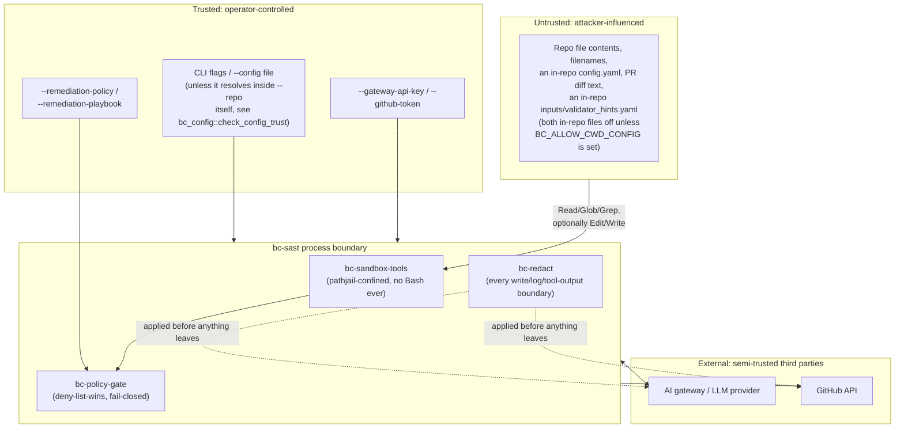

# Threat model: MITRE ATLAS

## Current implementation note

Target execution and publication now need explicit consideration in this
threat model. Compiled testing profiles can authorize restricted Linux
container commands, and full-scan delivery can push a new branch or export
updated source as a ZIP. Only the opt-in `discovered-offline` profile ships test execution
authorization; it resolves suggestions against compiled ecosystem allowlists.

The command-execution row below reflects those paths. Other framework
references retain their stated review dates; this update is not a full
ATLAS reassessment. See [implementation notes](../implementation-notes.md)
and [delivery](../remediation-delivery.md) for verified behavior and gaps,
including portable snapshot races and Git transport cleanup.

A systematic threat model of `bc-sast` itself (not the vulnerabilities it
*detects*), conducted by walking every tactic in the MITRE ATLAS matrix in
order and asking, concretely, whether and how it applies to this system.

**This is a companion to, not a replacement for,
[`AI_AGENT_SECURITY_REVIEW.md`](AI_AGENT_SECURITY_REVIEW.md)**, which
already did real, code-grounded ATLAS/OWASP LLM Top 10/AARM analysis and
found 8 ranked findings (one of which has since been fixed). This doc reuses that analysis's already-verified
technique citations and code claims rather than re-deriving them, and adds
the piece that doc didn't set out to be: a complete pass over **all 16**
ATLAS tactics (not just the techniques that happened to be most
LLM01/LLM06-relevant), including explicit "not applicable" calls with
reasoning, and a risk register sorted by residual risk.

**Source**: MITRE ATLAS v2026.06 (data schema version 5.6.0),
[`github.com/mitre-atlas/atlas-data`](https://github.com/mitre-atlas/atlas-data),
tag `v2026.06`, `dist/ATLAS.yaml`, the same release
`AI_AGENT_SECURITY_REVIEW.md` cites, fetched and parsed directly from the
tagged file rather than recalled from training data, so every technique ID
and name below is verifiable against that exact source. Canonical browsing
site: [atlas.mitre.org](https://atlas.mitre.org).

**Last verified 2026-07-27.**

## Methodology

For each of ATLAS's 16 tactics, in matrix order:

1. Decide **applicability** to `bc-sast` as a system, with reasoning.
   Several tactics are **out of scope** (e.g. tactics about
   attacking a *hosted* model's training/query surface, which `bc-sast`
   doesn't own), and saying so explicitly is more honest than force-fitting
   a technique into every box.
2. For applicable tactics, map the **specific techniques** that have a
   concrete `bc-sast` scenario to: what the scenario looks like, the
   current mitigation (or its absence), and a residual-risk rating
   (**High** / **Medium** / **Low**, matching
   `AI_AGENT_SECURITY_REVIEW.md`'s scale, plus **Not applicable** where a
   technique's own precondition is structurally unreachable in this
   system).
3. Cross-reference `AI_AGENT_SECURITY_REVIEW.md`'s finding numbers and
   OWASP LLM Top 10 categories wherever a technique restates a gap already
   found there. This doc does not re-litigate those, only re-frames them
   under ATLAS's own tactic structure and extends coverage to techniques
   that doc didn't examine.

Not every technique under every tactic is listed. Techniques reviewed and
judged to have no meaningful `bc-sast` scenario are named as
reviewed-and-dismissed (with a one-line reason) rather than silently
omitted, so a reader can tell "considered, doesn't apply" apart from "not
considered."

## System and assets recap

Full architecture: [`architecture.md`](../architecture.md); full
context/trust-boundary diagrams:
[`solution-design.md`](../solution-design.md). Recap of the trust
boundary this threat model is built on:

**Assets to protect**:

- The **scanning host/container** and, transitively, the CI runner it
  executes on.
- The **operator's credentials** (`--gateway-api-key`, `--github-token`)
  and any `--remediation-policy`/`--remediation-playbook` files.
- The **target repository's source integrity**: no unauthorized or
  backdoored edits landing on disk, especially under `--remediate`.
- The target repo's **secrets and PII** that the scanning agent's
  Read/Glob/Grep tools will, by design, encounter.
- The **trustworthiness of findings and remediation verdicts** reaching a
  human reviewer. A hallucinated or manipulated "this is fixed" is a
  distinct asset from source integrity itself.
- The **GitHub PR/comment channel** used to surface all of the above.

**Adversary profiles**:

- **A) Malicious or compromised repository content** is the primary,
  by-design threat actor: anyone who can get content into a repository or
  PR that `bc-sast` will scan (a malicious contributor, a compromised
  dependency vendored into the repo, a poisoned upstream template). This
  is the profile every pipeline stage already assumes is present.
- **B) A malicious or compromised AI gateway/LLM provider**: a
  man-in-the-middle or compromised endpoint sitting between `bc-sast` and
  the model it calls.
- **C) A malicious or careless operator/insider**: someone who runs
  `--remediate` without `--enforce-remediation-policy`, or supplies an
  overly permissive policy file, or reuses one token for both scanning and
  posting.
- **D) A compromised GitHub token**: the same credential used to fetch
  diffs and post comments, with no session/role separation from the
  scanning credential (already noted in `AI_AGENT_SECURITY_REVIEW.md`
  AARM-R6).

Profile A is what the bulk of this matrix is about; B-D are named because
several techniques below only make sense against them.

## ATLAS tactic-by-tactic matrix

### AML.TA0002 Reconnaissance: out of scope

ATLAS's Reconnaissance techniques (`AML.T0000` Search Open Technical
Databases, `AML.T0001` Search Open AI Vulnerability Analysis, `AML.T0003`
Search Victim-Owned Websites, `AML.T0006` Active Scanning, `AML.T0007`
Discover AI Artifacts) describe an adversary studying a victim's AI
footprint *before* attacking it. `bc-sast` exposes no network-reachable
service to reconnoiter, and the realistic adversary in this system's
threat model (Profile A) already has repository write access. Recon
against `bc-sast` itself isn't a meaningful separate phase. Not scored.

### AML.TA0003 Resource Development: precursor, outside bc-sast's boundary

- **`AML.T0065` LLM Prompt Crafting**, **`AML.T0066` Retrieval Content
  Crafting**: an adversary crafts source-code-shaped content
  (comments, docstrings, filenames) specifically designed to read as an
  instruction to the scanning/remediation/validation LLM while looking
  benign to a human reviewer. This happens entirely on the adversary's own
  infrastructure, before the content ever reaches a scanned repository.
  No `bc-sast` mitigation applies at this stage by definition. It's listed
  here because the *result* of this staging is exactly the input every
  technique under Execution/Persistence/Defense Evasion below is written
  against.

### AML.TA0004 Initial Access: applicable

| Technique | Scenario | Mitigation | Residual risk |
|---|---|---|---|
| `AML.T0010` AI Supply Chain Compromise (`.001` AI Software, `.004` Container Registry) | A compromised `crates.io` dependency, or a compromised container image built from this repo's `Dockerfile` and pushed to a registry you control, is initial access into **bc-sast's own** supply chain, distinct from anything about the LLM. | [`supply-chain.md`](../supply-chain.md)'s ≥30-day-old/real-adoption vetting policy; `cargo-deny check advisories bans licenses sources` on every CI run. This repo publishes no image: consumers build from the `Dockerfile` (and typically push it to a private registry of their own, see `deployment.md`), so signing and provenance attestation of that image are the consumer's controls on their own registry. | Low-Medium. Mitigated but not eliminated; a patient attack against an already-vetted, already-adopted crate is a residual risk shared by every Rust/crates.io consumer, not unique to `bc-sast`. |

`AML.T0049` Exploit Public-Facing Application is not applicable: `bc-sast`
exposes no network service or API of its own to exploit.

### AML.TA0000 AI Model Access: out of scope

This tactic covers gaining query/API access to a *hosted* model.
`bc-sast` doesn't host, own, or train a model. It's a consumer of an
operator-configured gateway/endpoint (Profile B territory). Direct model
access is a concern for whoever operates that gateway/provider, outside
`bc-sast`'s own control boundary. Not scored here (see `AML.TA0014` below
for the one place gateway-adjacent risk *is* scored).

### AML.TA0005 Execution: highly applicable

| Technique | Scenario | Mitigation | Residual risk |
|---|---|---|---|
| `AML.T0051` LLM Prompt Injection (`.000` Direct, `.001` Indirect) | The core technique: any file any stage's agent reads is a potential injection vector. | No mitigation *prevents* this. It's inherent to processing untrusted text as LLM input. Contained by: no `Bash` tool ever, path-jailing on every write, the policy gate (when enabled) on remediation, S11's fresh-session isolation, redact-before-serialize. See `AI_AGENT_SECURITY_REVIEW.md` LLM01 (already the doc's highest-relevance category). | **High** |
| `AML.T0053` AI Agent Tool Invocation (also Privilege Escalation, below) | An injection successfully reaching a real tool call, most consequentially `Edit`/`Write` during S10. | Path-jailing (`bc_pathjail::confine`, always on); throwaway-worktree isolation, so a git `--repo`'s own checkout is never edited; the post-patch tree-sitter syntax gate; the diff-size caps (`max_diff_lines`/`max_files_touched`); the unverified-patch rollback, all default-on. The CWE/path **authorization** gate (`--enforce-remediation-policy`) is the one that is **off by default** (finding #1). | **Medium-High** without policy enforcement enabled; **Medium** with it. |
| `AML.T0050` Command and Scripting Interpreter | Repository content attempts to cause command execution. | Model tools do not expose `Bash`, and session dispatch enforces advertised tools. The legacy operator-configured host verification command can execute target-controlled scripts. Compiled target-test execution profiles add a separate restricted Linux-container path; the opt-in `discovered-offline` profile authorizes exact discovered command shapes, plus one build-owned install command per ecosystem that runs in the only networked container of the run. Branch delivery runs controlled Git operations outside model tools. | Execution remains a relevant boundary. Host verification is rejected for target testing and branch/ZIP delivery; approved container commands still execute potentially hostile target code, and an install executes that project's packaging logic wherever the ecosystem offers no way to disable it. |
| `AML.T0100` AI Agent Clickbait | Repo content (a README, a comment) crafted to bait the remediation agent into treating an unintended action as legitimate (e.g. "to verify this is fixed, edit file X"). | The agent has no way to "just run" anything it's baited into. Every `Edit`/`Write` it actually issues still passes through the same pathjail/policy-gate checks regardless of why it chose to issue it. | Low |

`AML.T0103` Deploy AI Agent is not applicable: `bc-sast` doesn't deploy or
spawn agents beyond its own fixed, code-defined per-stage calls.

### AML.TA0006 Persistence: applicable

| Technique | Scenario | Mitigation | Residual risk |
|---|---|---|---|
| `AML.T0080` AI Agent Context Poisoning (`.000` Memory, `.001` Thread) | Injected content intended to persist and influence a *later* step in the same conversation. | S11 runs in a **fresh conversation**, not a continuation of S10's own tool-calling session, a real, verified boundary (`validation.md`). Partial: the diff S10 produced still crosses into S11's prompt verbatim. | Medium |
| `AML.T0099` AI Agent Tool Data Poisoning | A file positioned specifically for the scanning agent's own `Read`/`Glob`/`Grep` calls to retrieve and act on. | Nothing prevents ingestion (that's the tool's job by design); contained downstream by pathjail/no-`Bash`/policy-gate/redact. | Medium |
| `AML.T0081` Modify AI Agent Configuration | A malicious `config.yaml` checked into the scanned repo, attempting to change stage models, allowed tools, or redirect `--remediation-policy`/`--remediation-playbook` to an attacker-supplied file. | `bc_config::check_config_trust` refuses to proceed if `--config`'s resolved path lies inside `--repo` itself, a genuine pre-execution block, not a detect-after-the-fact control. | **Low**. A well-mitigated technique, worth calling out positively. |

`AML.T0110` AI Agent Tool Poisoning has low relevance: `bc-sast`'s own tools
are first-party Rust code with no plugin/MCP surface an attacker could
swap or redirect; there is no pluggable-tool architecture to poison. The
closer-fitting equivalent path is `AML.T0010` (Initial Access, above):
compromising `bc-sast`'s own source/build, not its tools at runtime.

### AML.TA0012 Privilege Escalation: applicable

| Technique | Scenario | Mitigation | Residual risk |
|---|---|---|---|
| `AML.T0054` LLM Jailbreak | Repo content attempts to override a stage's system prompt or anti-manipulation instructions. | S11's personas each carry an explicit anti-manipulation clause instructing them to ignore in-repo attempts to influence scoring (`@SuppressWarnings`, "already fixed" README claims, etc; see `validation.md`). Partial, matching OWASP's own note that prompt-level restrictions "may not always be honored." | Medium |
| `AML.T0053` AI Agent Tool Invocation (cross-listed from Execution) | The escalation from "text was read" to "a file was written" is itself a privilege-escalation step in ATLAS's model, not just an Execution one. | Same as above (pathjail + policy gate). | Same as Execution's entry |
| `AML.T0105` Escape to Host | Container escape from a compromised agent process to the underlying CI runner/host. | Minimal Wolfi nonroot (uid 65532) runtime, no host mounts beyond the scanned repo, standard container least-privilege (`CONTROL_MAPPING.md`'s hardened-container-runtime invariant). The agent's tool allowlist is Read/Glob/Grep/Edit/Write with no process-spawning tool, so it has no route to the `sh` the image now contains. | Low-Medium. The image build and a real containerized scan **have** since been run for real (see the root `README.md` §Status); `action.yml` invoked as a literal `uses:` action has now been exercised on a real runner: it could not load at all until the `github` context expressions were removed from the manifest, and the corrected manifest loads and passes the container's own paths. A full scan through that entry point is still unexercised. The runtime image gained a shell, `apk` and `git` when it moved off `distroless/cc` (see `CONTROL_MAPPING.md` §6): that does not give the agent a new capability, but it does make life easier for an attacker who already has code execution here by another route. |

### AML.TA0007 Defense Evasion: applicable (largest technique set of any tactic)

| Technique | Scenario | Mitigation | Residual risk |
|---|---|---|---|
| `AML.T0067` LLM Trusted Output Components Manipulation | Content crafted to make S10's diff *look* correct to S11's grader. | S11's independent, read-only, fresh-session review is the mitigation; imperfect since the diff itself is exactly what's being graded (`AI_AGENT_SECURITY_REVIEW.md` finding #3). | Medium |
| `AML.T0068` LLM Prompt Obfuscation | Instruction-shaped content hidden in comments/docstrings, obfuscated from a human reviewer skimming a diff. | Nothing in the pipeline specifically screens for obfuscated instruction-shaped content before it reaches a model. | Medium |
| `AML.T0094` Delay Execution of LLM Instructions | A dormant injection that triggers only when a *later* stage (e.g. validation, on a re-scan) processes the same or derived content. | None specific. Relevant precisely because `bc-sast` is a staged, multi-invocation pipeline. | Medium |
| `AML.T0074` Masquerading | A backdoor file/path named to resemble a legitimate one, to slip past a human reviewer's diff skim, or past a `deny_paths` glob that didn't anticipate the exact naming. | The policy gate's post-write inspection cross-references real `git diff`/`git status` output rather than trusting the agent's self-reported change list, but glob-pattern evasion via naming choice isn't fully closed. | Medium |
| `AML.T0109` AI Supply Chain Rug Pull | A dependency that was benign when it cleared the ≥30-day/adoption vetting bar turns malicious later. | `cargo-deny` re-runs advisories on every CI build (catches newly-published advisories going forward); no continuous behavioral re-vetting of already-accepted dependencies exists. | Low-Medium. A generic supply-chain residual risk, not `bc-sast`-specific. |

Reviewed and judged low/no direct relevance, named rather than silently
skipped: `AML.T0071` False RAG Entry Injection and `AML.T0092` Manipulate
User LLM Chat History (no RAG store or persistent chat history exists;
each invocation is a stateless CLI run); `AML.T0076` Corrupt AI Model (no
model owned by `bc-sast` to corrupt); `AML.T0073` Impersonation and
`AML.T0111` AI Supply Chain Reputation Inflation (social-engineering-of-a-
human techniques with no `bc-sast`-specific angle beyond what's already
covered by Profile C/D above); `AML.T0097` Virtualization/Sandbox Evasion
(no sandbox-detection-relevant behavior exists in the scan/remediate
loop to evade).

### AML.TA0013 Credential Access: applicable

| Technique | Scenario | Mitigation | Residual risk |
|---|---|---|---|
| `AML.T0098` AI Agent Tool Credential Harvesting (also covers `AML.T0055` Unsecured Credentials, same scenario, generic framing) | The scanning agent's `Read`/`Grep`/`Glob` tools retrieve a committed secret (a `.env` file, an API key) and the LLM echoes it into a finding description, report, or PR comment. | `bc-redact` applied at every write/log/tool-output boundary (Luhn/IIN/SSN/keyword-gated pattern matching). Per OWASP LLM02's own caveat, this is a strong mitigation, not a guarantee against a secret an attacker deliberately obfuscates to evade the regex layer. | Medium |

`AML.T0090` OS Credential Dumping, `AML.T0106` Exploitation for Credential
Access, `AML.T0082` RAG Credential Harvesting are not applicable: no
OS-level access surface exists (no `Bash`), and no RAG/vector store exists
in this pipeline (already established under OWASP LLM08 as not
applicable).

### AML.TA0008 Discovery: applicable, low severity

| Technique | Scenario | Mitigation | Residual risk |
|---|---|---|---|
| `AML.T0084` Discover AI Agent Configuration (also covers `AML.T0069` Discover LLM System Information) | Repo content structured to elicit "what tools/policy do you have access to" from an agent, directly or via a crafted prompt. | Accepted by design: gating logic lives in Rust code (the policy gate, pathjail), not in prompt secrecy, matching OWASP LLM07's existing framing. Discovering the system prompt doesn't reveal a way to bypass the actual controls. | Low |

### AML.TA0015 Lateral Movement: out of scope

`bc-sast` is a single-repo, single-invocation CLI process: no
network-reachable service, no persistent cross-run identity, no
multi-host topology to move within. The one boundary-crossing concern that
could resemble lateral movement (container escape to the host) is
already captured more precisely by `AML.T0105` under Privilege Escalation.
Not scored.

### AML.TA0009 Collection: applicable, by-design capability

| Technique | Scenario | Mitigation | Residual risk |
|---|---|---|---|
| `AML.T0037` Data from Local System | `bc-sast`'s `Read`/`Glob`/`Grep` tools ARE, by design, a full local-data-collection capability over the entire jailed repository tree. | This is necessary for the product to function. The control point is not "restrict collection" (that would break scanning) but what happens to what's collected: redact-before-serialize, and collection never leaves the jailed tree except through the model call / report / PR-comment boundary. | Medium, framed explicitly as **accepted and bounded by output-side controls**, not a defect to fix. |

### AML.TA0001 AI Attack Staging: out of scope

About an adversary building, training, or verifying a proxy attack model
offline, entirely outside `bc-sast`'s boundary, before a crafted payload
ever reaches a scanned repository. The "staging the payload itself" part
relevant to `bc-sast` is already captured by `AML.T0065`/`AML.T0066` under
Resource Development, above. Not scored.

### AML.TA0014 Command and Control: not applicable, explicitly

| Technique | Why not applicable |
|---|---|
| `AML.T0108` AI Agent | Would require an agent with shell/internet-reaching tools abusable as a C2 relay. No `Bash` tool exists at any stage, and no sandbox tool makes outbound network calls of its own (only the `LlmClient` itself talks to the operator-configured gateway, a single, intentional egress point). |
| `AML.T0072` Reverse Shell | Same reasoning. The runtime image does contain a `sh`, but no tool offered to any stage can spawn a process, so the agent has no way to reach it. |
| `AML.T0096` AI Service API | `bc-sast` exposes no inference API of its own for a C2 channel to hide inside. |

Worth stating explicitly, not just skipping this tactic: it demonstrates
the no-`Bash` design decision pays off across multiple tactics (Execution,
Command and Control), not only the one it was originally motivated by.

### AML.TA0010 Exfiltration: applicable

| Technique | Scenario | Mitigation | Residual risk |
|---|---|---|---|
| `AML.T0057` LLM Data Leakage | What `bc-redact` exists to stop, restated in ATLAS's vocabulary. | See `CONTROL_MAPPING.md` §2. | Medium |
| `AML.T0077` LLM Response Rendering | Results are posted to GitHub, which renders Markdown. An unredacted or injected finding is a concrete beacon-exfiltration vector (e.g. an image link with data encoded in its query string) even where raw-text redaction is otherwise sound. | None specific beyond redaction itself; Markdown-rendering-specific beaconing isn't separately screened. | Medium |
| `AML.T0086` Exfiltration via AI Agent Tool Invocation | A manipulated `Edit`/`Write` call encodes data read elsewhere in the repo into a committed file's content, to be read back out via the PR the attacker controls. | The write-then-inspect policy check (when enabled) inspects *paths* touched, not the semantic content of what was written. It is not designed to catch this. | Medium |

`AML.T0056` Extract LLM System Prompt has low relevance: `bc-sast`'s prompts
aren't secret/competitive IP the way a commercial LLM vendor's are
(matches the existing OWASP LLM07 framing). `AML.T0025` Exfiltration via
Cyber Means is generic framing, subsumed by `AML.T0086`'s concrete scenario
above rather than scored separately.

### AML.TA0011 Impact: applicable

| Technique | Scenario | Mitigation | Residual risk |
|---|---|---|---|
| `AML.T0101` Data Destruction via AI Agent Tool Invocation | `Edit`/`Write` corrupts or deletes a file. | By default S10 runs against a throwaway detached worktree and the user's own files are never modified at all. Destruction lands in a disposable checkout, and the result comes back as a patch file. `bc-diffcapture` snapshot/revert covers the rest; the `deny_paths` check specifically is write-then-inspect-then-revert, not prevent-then-write (finding #4). The worktree isolation now applies inside the container too: the runtime image ships `git`, where the previous `distroless/cc` image did not and every containerized run therefore degraded to in-place with a printed note. It still degrades that way whenever the scanned tree is not a git checkout. | Medium |
| `AML.T0034` Cost Harvesting, specifically **`.002` Agentic Resource Consumption** | A large or adversarially structured repository/PR coerces the agentic pipeline (S1/S4/S6, and especially S10/S11's multi-turn loops) into many expensive tool-call turns, driving up LLM spend. | Real enforcement, not just metering: `--max-tokens` and `--max-scan-seconds` are consulted at the S4-S7 stage boundaries *and* before each deep-dive chunk, verification session and semantic-dedup call; a trip stops new work, is recorded in `ScanMetrics::budget_stop`, and surfaces as a **BUDGET REACHED** line in the report. Per-stage `max_turns` ceilings bound each agentic session (S1 40, S6 30, S10 40, S11 50), and `UsageTrackingClient` meters spend per phase for the report. A provider reporting quota exhaustion trips the same gate from inside a stage. | **Low-Medium.** The ceilings exist; the residual gap is that the two global caps are opt-in with **no default value**, so an operator who never sets them runs unbounded. `max_budget_usd` is not a third control. It is no longer shipped as a default at all, and a config that still sets it loads with a warning naming the two caps that are real. |
| `AML.T0048` External Harms (`.001` Reputational Harm, `.003` User Harm) | A false "Fixed" S11 verdict reaching a human reviewer, who then ships a still-vulnerable fix. | Same as finding #3. S11 validation is optional and never blocking. | Medium (restates finding #3 at the Impact-tactic level; not a new mitigation surface) |
| `AML.T0112` Machine Compromise | The worst-case composite: `AML.T0105` Escape to Host followed by further host compromise. | Same mitigations/caveats as `AML.T0105` above. | Low-Medium (composite, inherits that entry's "untested" caveat) |

`AML.T0059` Erode Dataset Integrity has low relevance: `bc-sast` doesn't
maintain a persistent dataset of its own beyond ephemeral per-run
findings.

## Risk register (sorted by residual risk)

| Technique | Tactic | Residual risk | Cross-reference |
|---|---|---|---|
| `AML.T0051` LLM Prompt Injection | Execution | **High** | `AI_AGENT_SECURITY_REVIEW.md` LLM01 |
| `AML.T0053` AI Agent Tool Invocation | Execution / Privilege Escalation | **Medium-High** (authorization gate off by default; five other write gates on) / Medium (on) | finding #1 |
| `AML.T0034.002` Agentic Resource Consumption | Impact | Low-Medium (caps exist, no default value) | LLM10 |
| `AML.T0080` AI Agent Context Poisoning | Persistence | Medium | None |
| `AML.T0099` AI Agent Tool Data Poisoning | Persistence | Medium | None |
| `AML.T0054` LLM Jailbreak | Privilege Escalation | Medium | None |
| `AML.T0067` LLM Trusted Output Components Manipulation | Defense Evasion | Medium | finding #3 |
| `AML.T0068` LLM Prompt Obfuscation | Defense Evasion | Medium | None |
| `AML.T0094` Delay Execution of LLM Instructions | Defense Evasion | Medium | None |
| `AML.T0074` Masquerading | Defense Evasion | Medium | None |
| `AML.T0098` / `AML.T0055` Credential harvesting via tool / Unsecured Credentials | Credential Access | Medium | LLM02 |
| `AML.T0037` Data from Local System | Collection | Medium (accepted, bounded) | None |
| `AML.T0057` LLM Data Leakage | Exfiltration | Medium | LLM02 |
| `AML.T0077` LLM Response Rendering | Exfiltration | Medium | None |
| `AML.T0086` Exfiltration via AI Agent Tool Invocation | Exfiltration | Medium | None |
| `AML.T0101` Data Destruction via AI Agent Tool Invocation | Impact | Medium | finding #4 |
| `AML.T0048` External Harms | Impact | Medium | finding #3 |
| `AML.T0010` AI Supply Chain Compromise | Initial Access | Low-Medium | `supply-chain.md` |
| `AML.T0109` AI Supply Chain Rug Pull | Defense Evasion | Low-Medium | `supply-chain.md` |
| `AML.T0105` Escape to Host | Privilege Escalation | Low-Medium | README §Status |
| `AML.T0112` Machine Compromise | Impact | Low-Medium (composite) | None |
| `AML.T0081` Modify AI Agent Configuration | Persistence | **Low** (well-mitigated) | None |
| `AML.T0084` / `AML.T0069` Discover AI agent configuration / system info | Discovery | Low | LLM07 |
| `AML.T0100` AI Agent Clickbait | Execution | Low | None |
| `AML.T0110` AI Agent Tool Poisoning | Persistence | Low (no plugin surface) | None |
| `AML.T0050` Command and Scripting Interpreter | Repository content attempts to cause command execution. | Model tools do not expose `Bash`, and session dispatch enforces advertised tools. The legacy operator-configured host verification command can execute target-controlled scripts. Compiled target-test execution profiles add a separate restricted Linux-container path; the opt-in `discovered-offline` profile authorizes exact discovered command shapes, plus one build-owned install command per ecosystem that runs in the only networked container of the run. Branch delivery runs controlled Git operations outside model tools. | Execution remains a relevant boundary. Host verification is rejected for target testing and branch/ZIP delivery; approved container commands still execute potentially hostile target code, and an install executes that project's packaging logic wherever the ecosystem offers no way to disable it. |
| `AML.T0108` / `AML.T0072` / `AML.T0096` | Command and Control | Not applicable | None |
| `AML.T0090` / `AML.T0106` / `AML.T0082` | Credential Access | Not applicable | None |
| Reconnaissance, AI Model Access, Lateral Movement, AI Attack Staging | Whole tactics | Out of scope | None |

## Recommendations

The Medium/High entries above that trace back to an already-identified gap
(prompt injection's structural inherence, the policy gate defaulting off,
S11 being non-blocking, write-then-revert timing) are not re-recommended
here. See `AI_AGENT_SECURITY_REVIEW.md`'s own "Recommendations" section,
which already proposes scoped fixes for each.

**The one recommendation this exercise raised has since been implemented.**
`AML.T0034.002` Agentic Resource Consumption sharpened OWASP LLM10's
hedged "not confirmed absent" into a named, expected attack pattern, and
asked for a per-repo/per-PR turn or token ceiling. `--max-tokens` and
`--max-scan-seconds` now provide exactly that, enforced inside the S4/S6
loops rather than only at stage boundaries, and a provider quota
exhaustion trips the same gate. What remains is a *policy* question, not
an engineering one: neither cap has a default value, so an unbounded run
is still what an operator gets by not asking. Setting a shipped default
would trade a predictable ceiling against silently truncating a large
repository's scan. This is presented as a decision, not applied here.
