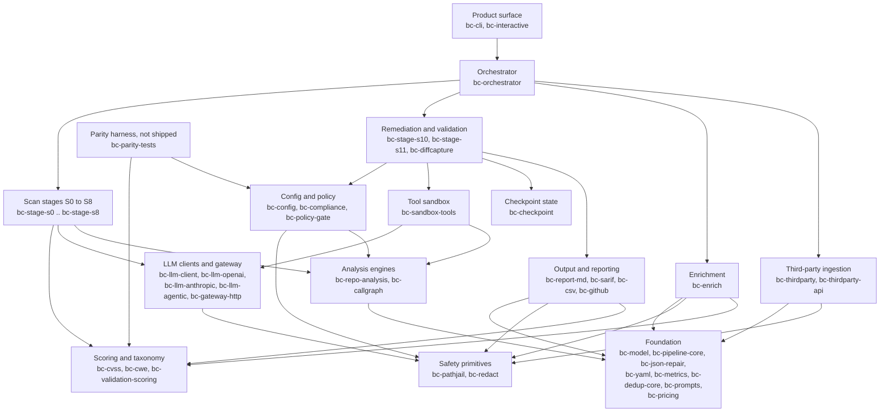

# Crate map

The workspace is `members = ["crates/*"]`: **47 crates**, one binary
(`bc-cli`, which builds `bc-sast`). The dependency graph is a strict DAG:
every crate depends only on crates in a lower or equal tier, never a higher
one, and the tiers were derived from the actual `path = "../..."` edges
rather than assigned by hand.

Drawing 47 nodes is unreadable, so this map groups them into 16 boxes and
draws the group-level edges. Edges implied by transitivity are omitted.
`bc-stage-s4` really does depend on `bc-model`, but the arrow is not drawn
because *Scan stages to Analysis engines to Foundation* already says so.

## Group-level dependency graph

## What each group is

| Group | Crates | What it is |
|---|---|---|
| **Foundation** | `bc-model`, `bc-pipeline-core`, `bc-json-repair`, `bc-yaml`, `bc-metrics`, `bc-dedup-core`, `bc-prompts`, `bc-pricing` | Pure logic, no workspace dependencies. `bc-model` is the cross-stage DTO spine with lenient LLM-JSON coercion; `bc-pipeline-core` encodes the "degrade rather than crash" policy as a type; `bc-prompts` holds shared prompt blocks as `&'static str` so prompt-cache prefixes stay byte-identical; `bc-pricing` prices one call's token counts against a vendored models.dev table and has no consumer in the pipeline yet. |
| **Safety primitives** | `bc-pathjail`, `bc-redact` | Path confinement and UNC/SMB rejection; stateless secret/PAN/SSN masking. Both pure, both leaves of the graph. |
| **Scoring and taxonomy** | `bc-cvss`, `bc-cwe`, `bc-validation-scoring` | CVSS 3.1 calculator, CWE id-to-name lookup, and the deterministic S11 fix-validation engine. |
| **Config and policy** | `bc-config`, `bc-compliance`, `bc-policy-gate` | YAML load with overlay and `${VAR}` expansion plus the config-trust gate; compliance rules steering prompts; the no-LLM remediation eligibility gate. |
| **LLM clients and gateway** | `bc-llm-client`, `bc-llm-openai`, `bc-llm-anthropic`, `bc-llm-agentic`, `bc-gateway-http` | `bc-llm-client` is the dialect-agnostic trait seam with no HTTP in it; the two dialect crates and the multi-turn tool-use loop are written against that seam. |
| **Tool sandbox** | `bc-sandbox-tools` | The jailed `ToolExecutor`. `Read`/`Glob`/`Grep` always; `Edit`/`Write` only via `new_with_write`; **`Bash` never**. |
| **Analysis engines** | `bc-repo-analysis`, `bc-callgraph` | The two LLM-free engines: the deterministic repo walk with taint-path chunking, and the tree-sitter source-to-sink call-graph seed engine. |
| **Checkpoint state** | `bc-checkpoint` | `CheckpointStore` trait plus null and SQLite implementations. Zero workspace dependencies. |
| **Scan stages S0 to S8** | `bc-stage-s0` ... `bc-stage-s8` | The detection pipeline. See [`pipeline.md`](pipeline.md). |
| **Remediation and validation** | `bc-stage-s10`, `bc-stage-s11`, `bc-diffcapture` | Phase 2 and 3. Grouped with `bc-diffcapture` because snapshot/revert is what makes them safe to run. |
| **Enrichment** | `bc-enrich` | Post-S7 CMDB-driven environmental CVSS and offensive priority. |
| **Output and reporting** | `bc-report-md`, `bc-sarif`, `bc-csv`, `bc-github` | `bc-sarif` owns the stable `finding_id` fingerprint; `bc-csv` and `bc-github` both reuse it. |
| **Third-party ingestion** | `bc-thirdparty`, `bc-thirdparty-api` | Vendor export parsing and live vendor API clients, both producing the same shape for re-verification through S6/S7. |
| **Orchestrator** | `bc-orchestrator` | Sequences the stages. Knows stage *order*, degrade handling and early stop. Knows nothing about prompts or rendering. |
| **Product surface** | `bc-cli`, `bc-interactive` | Flag parsing, concrete client wiring, disk writes; the arrow-key finding picker. |
| **Parity harness** | `bc-parity-tests` | Not shipped. Runs the real Python `vvaharness` source and diffs its output against `bc-cvss` / `bc-redact` / `bc-config` / `bc-validation-scoring`. Excluded from the coverage gate. |

## Edges worth knowing about

These are the places where the shape is not what a reader would guess.

- **There is no `bc-stage-s9`.** In the Python original, S9 was a step that
  re-parsed the Markdown report to produce SARIF. Here `bc_sarif::build_sarif`
  is driven directly from the typed `FinalReport`, so the stage has nothing
  left to do and does not exist.
- **`bc-stage-s10` and `bc-stage-s11` do not depend on `bc-pipeline-core`.**
  They are named "stages" but do not implement the `PipelineStage` trait.
  Only S0 through S8 do. They are separate phases, not pipeline steps.
- **`bc-llm-client` depends on `bc-redact`.** Redaction of provider
  responses is baked into the trait seam itself, so a caller cannot forget
  to apply it.
- **`bc-interactive` reaches `bc-stage-s10`/`bc-stage-s11` directly**,
  bypassing the orchestrator. The picker drives remediation itself.
- **`bc-report-md` and `bc-sarif` depend on `bc-validation-scoring`**, so
  S11's fix verdicts can surface in the report.
- **`bc-stage-s0` depends on `bc-llm-client`** despite being the "static"
  stage. That is true only in `llm` spec-detection mode, which makes exactly
  one call to choose which source/sink specs to match; the walk itself is
  LLM-free. See [`seed-plane.md`](seed-plane.md).
- **`bc-cli` is the widest node** (33 workspace dependencies) but is *not* a
  superset of the orchestrator's: `bc-enrich`, `bc-metrics`, `bc-cwe`,
  `bc-cvss`, `bc-yaml` and `bc-llm-agentic` are orchestrator-owned and the
  CLI never touches them.

Same-tier edges inside a group, not drawn above: the three dialect crates
depend on `bc-llm-client`; `bc-stage-s1` on `bc-stage-s0`; `bc-stage-s5` on
`bc-stage-s7` (S5 reuses S7's deterministic dedup pass); `bc-stage-s11` on
`bc-stage-s10`; `bc-csv` and `bc-github` on `bc-sarif`;
`bc-thirdparty-api` on `bc-thirdparty`; `bc-cli` on `bc-interactive`.
