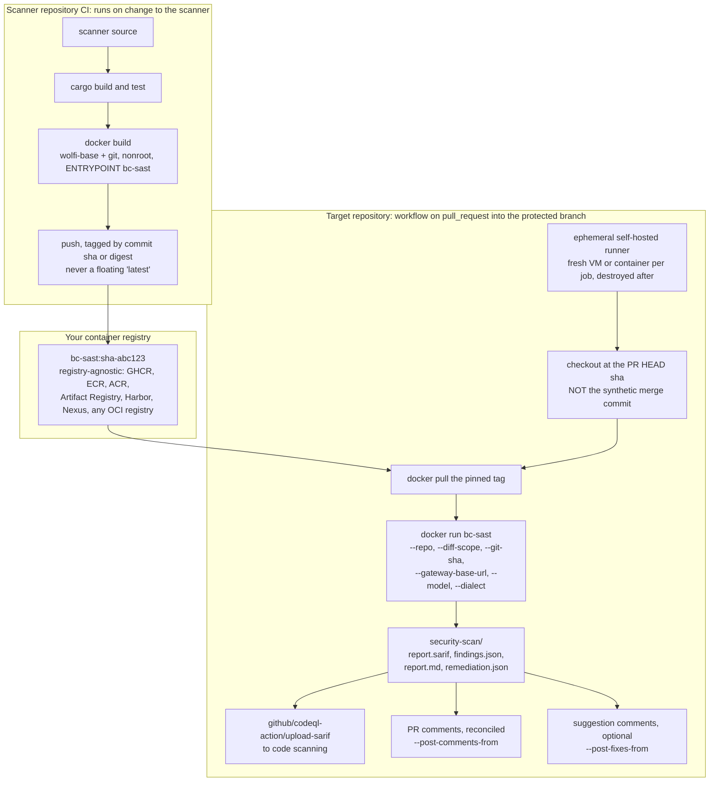
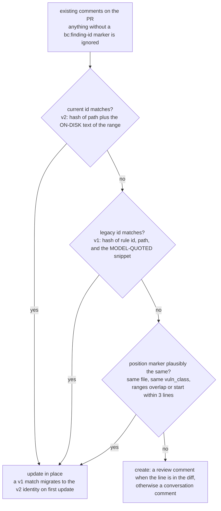
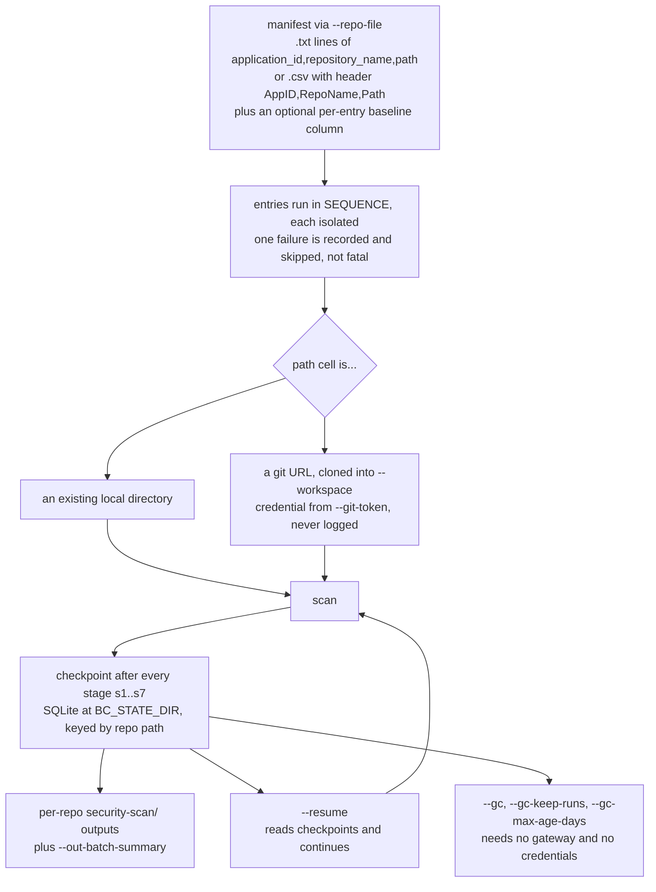
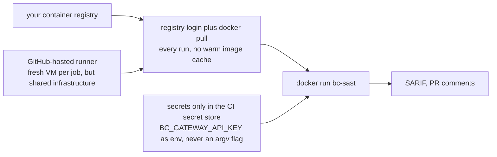
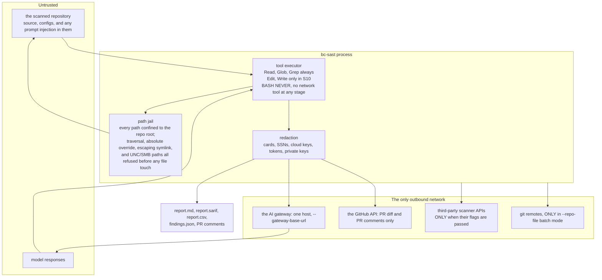

# Deployment models

Four shapes, in the order most people will want them. Every flag, env var
and marker named below is the real one. See `action.yml`,
[`../github-action.md`](../github-action.md) and
[`../USER_GUIDE.md`](../USER_GUIDE.md).

`bc-sast` is a CLI, not a standing service. Nothing here needs a server,
a database, or an inbound port.

---

## (a) Recommended: prebuilt image, pulled by the target repo's PR workflow

Build the scanner **once** in its own repository's CI, containerize it, push
it to your container registry, and have each target repository's
pull-request workflow *pull* that image and run the scan. The scan itself
runs on an **ephemeral self-hosted runner**, so the container, the checkout
and the credentials all disappear with the job.

This is the recommended model because the alternative, the shipped
`action.yml` (a Docker container action with `image: "Dockerfile"`),
rebuilds the scanner from Rust source on every single pull request. That
is correct, and it is what makes the action work with no registry at all,
but it is minutes of build time per PR that a prebuilt image simply does not
spend.



### Details that are not optional

- **Check out the PR head sha.** A bare `actions/checkout` gives you the
  synthetic merge commit, and the finding line numbers will not match the
  diff. Use `ref: ${{ github.event.pull_request.head.sha }}`, and pass the
  same sha as `--git-sha`.
- **Make the checkout writable, and hand it to uid 65532.** The container
  runs as `nonroot` (uid 65532) and its entrypoint is the scanner, so
  nothing inside it fixes ownership first. Without a writable workspace,
  `--remediate` silently produces `diff: null`. `chmod` is not enough on
  its own: the image ships `git`, but git 2.35 and later refuse a
  repository owned by another user, so without `chown -R 65532:65532 .`
  the HEAD-sha detection, worktree isolation and git revert backstop all
  probe, get "no git", and stay off.
- **`--diff-scope` is real scoping, not cosmetic.** It requires
  `--github-token`, `--github-repo` and `--pr-number`, and **fails hard
  rather than falling back to a full scan** if they are missing. S3 trims
  chunk file lists to the diff intersection and S4 drops, in code, any
  finding on an out-of-scope file. A PR whose diff carries no changed
  source lines at all (only renames, deletions, mode changes or binary
  files) scopes to **nothing** rather than to everything: the run warns,
  completes green, and the report says `Scope: PR diff (0 of N files)`.
  Note it is **not** an `action.yml` input; use `docker run` directly,
  which this model does anyway.
- **Commenting is a separate opt-in from scoping.** `--diff-scope` says
  what to analyze; `--pr-comments` says whether to write the results back
  to the pull request, and it is off by default, so credentials alone
  never post. It requires `--diff-scope` and refuses at startup without
  it, since a finding outside the diff has no line to anchor a comment to.
- **The scanner never uploads SARIF itself.** It writes `report.sarif` and
  the maintained `github/codeql-action/upload-sarif` action uploads it.
  The scanner's only GitHub API calls are the PR diff and PR comments.
- **Fork PRs need the two-workflow split.** A `pull_request` workflow from a
  fork has no write token by design. Run the scan unprivileged, upload the
  results as an artifact, and post them from a second `workflow_run`
  workflow that holds `security-events: write` and `pull-requests: write`.
  That second workflow never checks out fork code.

### How a PR comment finds its previous self

Re-running on a new push must **update** the existing comment, not post a
second one. Every comment body ends with two hidden markers:

```
<!-- bc:finding-id={id} -->
<!-- bc:loc={line_start}:{line_end}:{vuln_class}:{file} -->
```

Matching is three tiers, strongest first:



Neither id includes a line number, so a force-push that shifts lines does not
mint a duplicate alert. The position marker exists because both id tiers hash
*content*, and a run that redraws a finding's **boundary** (`app.py:28-29`
one run, `app.py:25-29` the next, same lines, unchanged file) changes the
hash. It is checked last so an exact identity always beats the heuristic, and
`vuln_class` must agree so two different weaknesses on one line stay two
findings.

Fix suggestions follow the same identity, suffixed `:fix` or `:fix:0`,
`:fix:1`. A hunk entirely on diff-touched lines becomes an anchored
` ```suggestion ` comment with GitHub's one-click *Commit suggestion*;
anything else becomes an unanchored ` ```diff ` comment. The patch is never
applied from the comment body (the rendered diff is redacted and will not
`git apply`), so an `/apply-fix` flow re-downloads `remediation.json`.

---

## (b) Scheduled or batch full scans

Many repositories, one invocation, on a timer.



The checkpoint asymmetry is worth knowing: **checkpoints are written on
every scan**, whether or not `--resume` was passed. `--resume` only controls
*reading* them. A fresh non-`--resume` run resets its own run's rows first,
so a later `--resume` can never load stale state from a previous attempt.
Remediation checkpoints are per finding and matched by identity (same
position, title, file and rendered body), so a checkpoint whose finding has
changed is re-attempted rather than skipped.

---

## (c) Hosted-runner variant

The same flow on GitHub-hosted runners, when self-hosted infrastructure is
not available or not wanted.



The trade-offs against (a), stated plainly:

- **Not ephemeral in the same sense.** A hosted runner is a fresh VM per
  job, but it is shared infrastructure you do not control and cannot
  inspect. A self-hosted ephemeral runner is infrastructure you own, on your
  network, destroyed after the job.
- **The image is pulled on every run**, with no warm local cache, so you
  pay the pull each time, and the registry must be reachable from GitHub's
  network (or the image must be public).
- **Secrets live only in the CI secret store**, injected as environment
  variables. `BC_GATEWAY_API_KEY` is read from the environment and is
  **never** passed as a command-line argument, so it cannot leak through a
  process list or a command echo.
- A private registry needs a registry login step with its own credential,
  which is one more secret in the store.

Everything else (flags, outputs, SARIF upload, comment reconciliation) is
identical to (a).

---

## (d) Trust boundaries

The scanned repository is **untrusted input**. So is every model response.
Both assumptions are enforced structurally rather than by prompt.



### What each boundary actually enforces

**The path jail** confines every path to the repo root and refuses an empty
candidate, a UNC or SMB network path, an absolute-path override, `..`
traversal, and any symlink resolving outside the root. Callers must treat a
refusal as inaccessible and never fall back. The resolver is incremental
rather than lexical: components are canonicalized front to back, so `..`
after a resolved symlink goes to the *target's* parent instead of lexically
canceling the symlink. Directory walks and glob expansions **re-confine
every discovered entry** rather than trusting the walk.

**The tool surface is the security boundary.** There is no `Bash` tool and
no network tool at any stage, under any construction. Untrusted repository
content can influence text; it can never open a socket or run a command.
Read-only stages get `Read`, `Glob`, `Grep`. Only S10's remediation loop
gets `Edit` and `Write`, and only through a separate constructor.

| Tool | Cap |
|---|---|
| `Read` | 200,000 chars returned, 800,000 bytes off disk regardless of offset |
| `Glob` | 500 results, then a truncation marker |
| `Grep` | 200 matches; 50,000 chars per line fed to the regex, bounding backtracking |
| `Edit` | refuses identical strings, zero matches, or more than one match |

**Redaction happens before any serializer.** The whole report goes through a
single JSON-tree redaction pass right after S8, and Markdown, SARIF, CSV,
`findings.json` and `remediation.json` are all built from that
already-redacted value, so a new field is covered for free rather than
needing its own pass. Tool output going back to the model is redacted too,
as is everything rendered toward GitHub.

There is one documented hole: a **write-capable** executor turns `Read` and
`Grep` redaction off by default, because `Edit` requires a byte-for-byte
match against the file and a redacted read makes a hardcoded-secret finding
structurally unfixable. That widens exposure **to the model provider only**
(everything S10 emits is still redacted before it reaches disk or GitHub),
and it can be forced back on.

**Egress is narrow but not one host.** The honest list is the gateway, the
GitHub API (only the PR diff and PR comment endpoints; there is no
code-scanning call, because SARIF upload is the CodeQL action's job), the
third-party scanner APIs *only* when their flags are passed, and git remotes
*only* in batch mode. None of these is reachable from scanned content.

**Secrets.** The gateway key is an environment variable
(`BC_GATEWAY_API_KEY`), never an argv flag. `--ca-cert` takes a private CA
bundle for an internal gateway. Note it **replaces** the platform trust
store rather than adding to it, and there is no flag anywhere to disable TLS
verification. A `--config` that resolves *inside* `--repo` is refused
outright, because the scan target is attacker-influenced.
