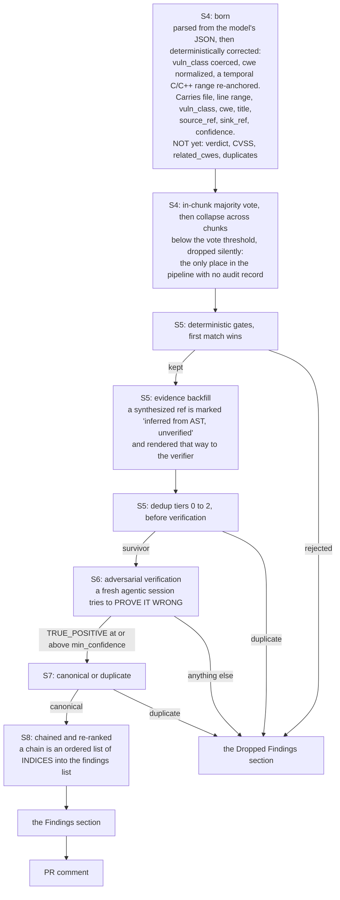
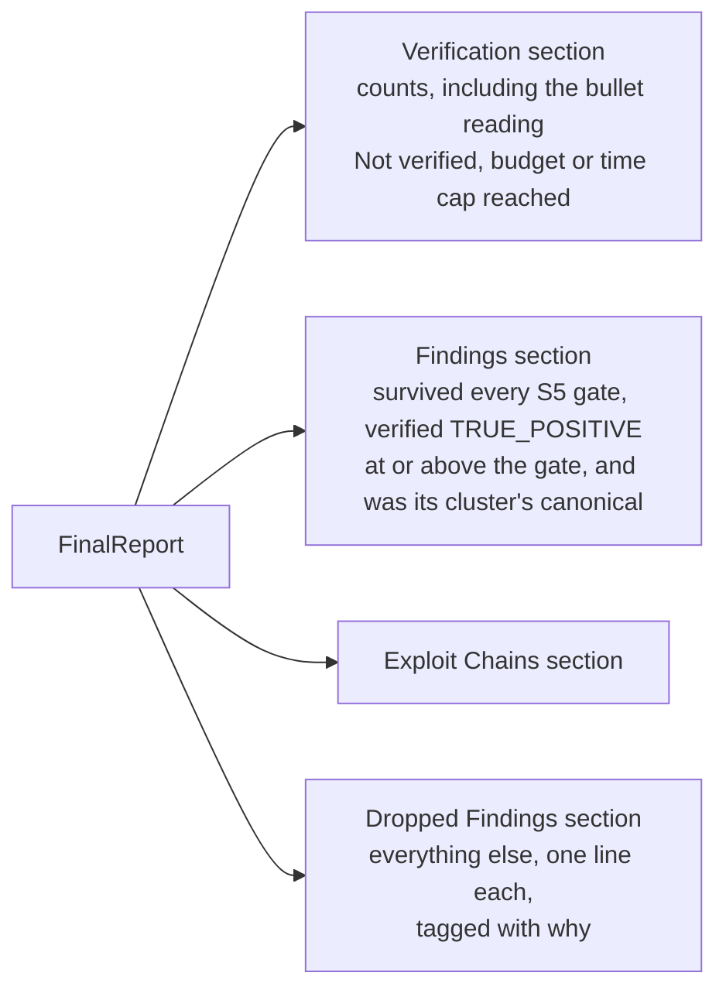

# The life of a finding

One finding, from the moment a model first claims it to the moment a
reviewer sees it on a pull request. This is where the precision difference
measured in [`../comparison.md`](../comparison.md) is actually made: not by
finding more, but by what happens to a claim after it is made.

There is **no separate "candidate" type**. A finding is born as `Finding`
and it is the same struct that reaches the report. It has **no id field**;
identity is derived from content on demand, which is what makes it stable
across runs.

## The whole path



## What each transition actually decides

### S4: birth

A candidate is a `Finding` deserialized straight from the model's JSON. An
item that fails to parse is skipped. A `vuln_class` that is present but not
one of the twelve valid values is coerced to `other`; a *missing* one fails
validation and the item is dropped. `cwe` is normalized to canonical
`CWE-<n>` form, and an unparseable value becomes null rather than garbage.

One more deterministic correction lands here, on the line range itself.
`bc-stage-s4::reanchor` reads a use-after-free, double-free or TOCTOU
finding in a C/C++ file whose `line_start` sits on a `free`/`delete`, finds
the first genuine later use of that pointer, and rewrites the range to span
release-to-use, recording which fields it touched in `reanchored`. It runs
before the vote on purpose: the vote buckets on the line, so two runs that
disagree only about the anchor would otherwise split their own vote. Every
ambiguity declines and leaves the range as the model wrote it.

Then N runs of the same chunk are clustered and majority-voted, and the
survivors are collapsed again across chunks. **This is the one place a
claim disappears without an audit record**. The dropped-findings machinery
does not exist yet at that point in the stage.

### S5: the gates

Six gates in a strict first-match-wins chain, so a finding is dropped by at
most one. See [`pipeline.md`](pipeline.md) for the full chain and
[`guard-gate.md`](guard-gate.md) for the route gate in detail.

Every rejection becomes a `DroppedFinding` carrying the file, line, class,
title, chunk id, a reason, and a human-readable detail. **Nothing is dropped
silently.** That is the design commitment that makes the report's own
numbers checkable.

### S6: the verdict

The verdict enum has exactly **two** variants: `TRUE_POSITIVE` and
`FALSE_POSITIVE`. Everything else is expressed as a drop reason, which
matters more than it sounds:

| What happened | Where it goes | Tag in the report |
|---|---|---|
| True positive at or above `min_confidence` | `## Findings` | none |
| True positive *below* the confidence gate | dropped | `UNCONFIRMED` |
| Genuine false positive, with the verifier's reason | dropped | `FP` |
| Verifier reply unparseable, or the session failed | dropped | `VERIFY-ERR` |
| Provider guardrail blocked the session | dropped | `GUARDRAIL` |
| **Budget stop, the verifier never ran** | dropped | `UNCONFIRMED`, detail begins `"not verified"` |

The last row is the important one. An unparseable reply is **never
laundered into a false positive**, and a finding the verifier never saw is
never laundered into a confirmed one. As the code puts it: the verifier
never ran, so the honest claim is "we could not confirm this".

### S7: canonical or duplicate

The canonical is simply the **lowest-index** member of a cluster, which
means the *sort* is the decision. The nine sort keys, in order:
sink-anchoredness, file, `line_start`, severity, `vuln_class`, CWE rank
(a specific CWE beats an umbrella such as CWE-20 or CWE-200), verdict
confidence, S4 confidence, and title as a total-order backstop.

The CWE key sits deliberately *ahead* of both confidence keys, because
confidence is a model output that moves between runs, and was observed
flipping a finding's identity between two scans of the same commit.

A loser is not merely discarded. Its location is attached to the canonical's
`duplicates` list, its CWE is folded into the canonical's `related_cwes`
(rendered as the report's *"Also flagged as:"* line and as extra SARIF
taxa), and if the canonical's class is `other` while the loser's is
specific, the canonical **adopts the loser's class**. Then the loser is
recorded as a `Duplicate` drop pointing at its canonical.

### S8: chains

A chain is a title, a severity, a narrative, a list of blocking controls,
and `steps`, an ordered list of **indices into the report's findings
list**. There is no chain id on a finding; that index list *is* the link.
Chains are remapped when findings are re-sorted by severity, and a chain
left with fewer than two surviving steps is discarded rather than shown as
a one-step "chain".

## Where a finding lands in the report



> [!NOTE]
> **There is no `## Not verified` section.** "Not verified" is a *bullet*
> inside `## Verification`, reading
> `- Not verified (budget/time cap reached): N`, with a matching
> **Not examined** bullet in the executive summary. The findings
> themselves sit in `## Dropped Findings`, tagged `UNCONFIRMED`.

The `UNCONFIRMED` tag covers two different situations, and the code
distinguishes them by a **string prefix on the detail**: a detail starting
`"not verified"` means the verifier never ran, while any other
`UNCONFIRMED` detail means it ran and returned low confidence. That prefix
is load-bearing: it is what keeps verification precision honest, because
the denominator must be *examined* findings, not raw candidates.

Full tag list: `EXCLUDED`, `UNCONFIRMED`, `FP`, `VERIFY-ERR`, `GUARDRAIL`,
`DUP of #n`, and `DUP (pre-verify)`. The last has no canonical index on
purpose, because a pre-verify index would point into a list that goes stale
as soon as S6 drops false positives.

## Identity: how a finding recognizes itself next run

Three id functions exist, for three different jobs. Confusing them is easy
and the consequences are invisible until a reviewer gets duplicate comments.

| Id | Hashes | Job |
|---|---|---|
| **v1** | rule id (the vuln class), path, and the **model-quoted** snippet | The **within-run** correlation key. S10 remediation checkpoints and the S11 validation map are keyed on it, which is why it must not change. |
| **v2** | path and the **on-disk text** of the line range. No rule id. | The **cross-run** stable identity. |
| S10 resume identity | finding index, title, file, rendered body | Staleness detection for `--resume` only. Explicitly not a security control. |

v2 fixes two real sources of churn. First, v1 hashes the snippet *the model
quoted*, which varies run to run; v2 reads the range off disk (through the
path jail, so a model-authored `../../etc/passwd` resolves to
"inaccessible"). Second, v1 keys on the vuln class, so a mere
reclassification minted a brand-new alert; v2 leaves the class out
entirely, on the principle that **the identity of a finding is where it is,
not what this run decided to call it**.

Neither id includes a line number, so a force-push that shifts lines does
not mint a duplicate alert. Both are published side by side in SARIF
`partialFingerprints` under `bc/findingId/v1` and `bc/findingId/v2`, so a
consumer matches on whichever key it recognizes.

## From finding to PR comment

Every comment body ends with two hidden markers, the identity and the
position:

```
<!-- bc:finding-id={id} -->
<!-- bc:loc={line_start}:{line_end}:{vuln_class}:{file} -->
```

The identity marker is read from its **last** occurrence in the body, so a
marker-shaped string inside the finding's own text cannot hijack it. In the
position marker the file path goes **last** and takes the rest of the
payload, because a path can contain colons.

Matching on re-run is three tiers, strongest first: current (v2) id, then
legacy (v1) id, then the position marker (same file, same `vuln_class`,
ranges overlapping or starting within three lines). A legacy match still
applies the current body, so a comment **migrates to the v2 identity the
first time it is updated**.

The position tier exists because both id tiers hash content, and a run that
redraws a finding's *boundary* changes the hash: one run described a path
traversal as `app.py:28-29`, the next as `app.py:25-29`. Same lines, same
unchanged file, different hash, and the reviewer got a second comment. It is
checked last so an exact identity always wins, and `vuln_class` must agree
so two different weaknesses on one line stay two findings.

A comment with no `bc:finding-id` marker is ignored entirely; a comment
predating the position marker is simply unmatchable by position. An existing
comment's kind (review or conversation) always wins over what this scan
would have chosen, so a comment never jumps location between runs.

This is the machinery behind the Flask pull-request result in
[`../comparison.md`](../comparison.md): **5 of 5 finding identities kept
across runs, comments updated rather than duplicated.**
