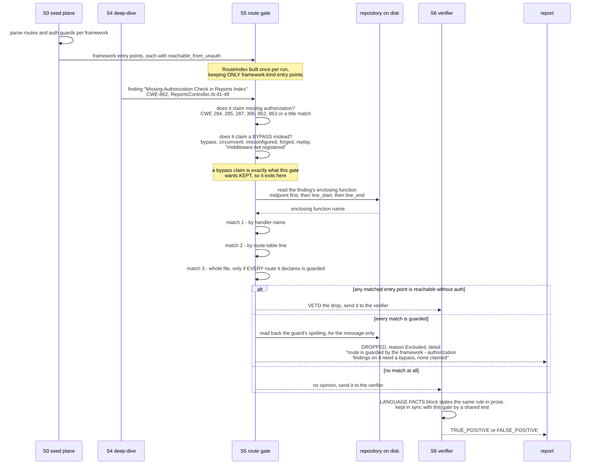

# A "missing authorization" finding meets the route gate

This is the single most instructive path through the pipeline, because it is
where a deterministic fact beats a confident model, twice. S4 raised these
findings and S6 *confirmed* them. Both were wrong in the same direction, on
four different frameworks: Laravel's `Route::middleware(['auth'])->group`,
Ktor's `authenticate("auth-session")`, Rails' `before_action
:authenticate_user!`, and axum's
`.route_layer(middleware::from_fn(require_operator_token))`.

The gate that catches them reads S0's framework route table, which knows
what middleware is applied because it parsed it, and drops the claim
before it ever costs a verification session.

## The sequence

## Why each rule is shaped the way it is

**Only framework-kind entry points count.** `reachable_from_unauth` is a
defaulting field, so an S1 survey agent that never mentions it leaves it
`false`, which *reads* as "guarded" but *means* "unknown". Acting on that
would drop real findings. Only S0's framework plane sets the flag from
evidence, so only S0's framework plane is trusted here. S6 applies the same
restriction when it decides whether to print a `[GUARDED]` marker.

**A bypass claim exits before any matching happens.** A finding that says
"the auth middleware is misconfigured" or "the guard can be forged" is
precisely the finding this gate exists to preserve. It must never be the
thing the gate drops.

**The enclosing function is resolved from the range midpoint first.** A model
routinely starts a range a line early. A live Rails run matched "Missing
Authorization Check in Reports Index" to the *open* `search` action sitting
above it, and would have dropped a guarded-route finding for the wrong
reason.

**Guards join to routes within the declaring file.** A repo-wide join on
bare method names would mark an unguarded `list` as authenticated because
some other file happens to guard a same-named method. Rails is the one
exception: a `#`-qualified handler id like `users#show` names a handler
globally, so those join across files.

**The whole-file rule needs unanimity, and that is the point.** It is
deliberately the weakest match: one open route anywhere in the file disables
it. It exists for a finding raised on the route table itself, and for a
route whose entry point still carries a path-derived synthetic id. Ktor
used to be the standing example of the latter, and no longer is: the
Kotlin section names a route after the function its lambda delegates to,
so `listOwnedReports` is matched by name and dropped while the open
`searchReports` declared in the same file is kept, which is exactly the
case unanimity could not tell apart. A Ktor lambda with a body of its own,
and any delegate two routes in a file share, still fall back to the
synthetic name and so still need this rule.

**The guard's name is cosmetic.** It is read back out of the source only to
make the drop message legible (`middleware('auth')`,
`authenticate("auth-session")`, `before_action :authenticate_user!`,
`middleware::from_fn(require_operator_token)`), falling back to a generic
label. The decision itself is made entirely on the boolean; the guard's
spelling never decides anything.

**A guarded route refutes only the authorization claim.** S6's system prompt
is explicit about this: injection, path traversal, SSRF or deserialization on
a guarded route stays a true positive. Authentication is not a fix for a SQL
injection; it only means an attacker needs an account first.

## What it costs when it is not there

The gate is one of three deterministic filters that account for the
precision difference measured in [`../comparison.md`](../comparison.md).
Like the event-loop and template auto-escape gates, it asks the model
nothing. It is a cheap, repeatable check applied to what the model already
said, and it fires *before* verification, so each drop is a whole multi-turn
agentic session that never has to run.
