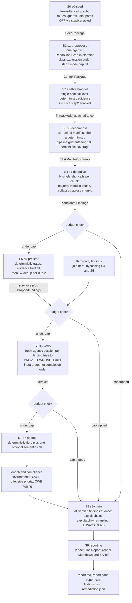
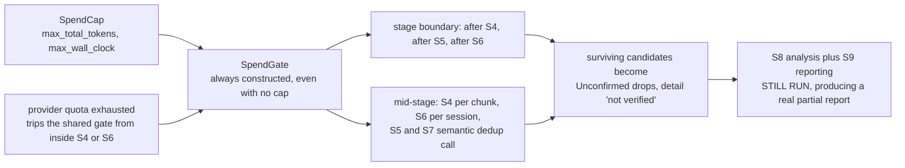
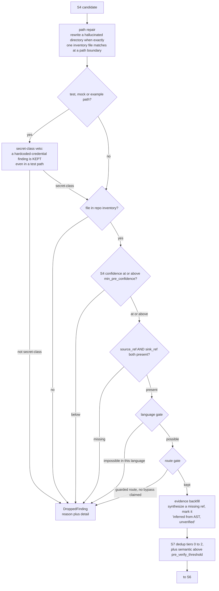
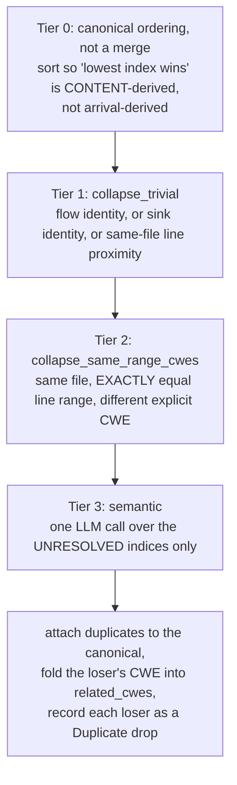
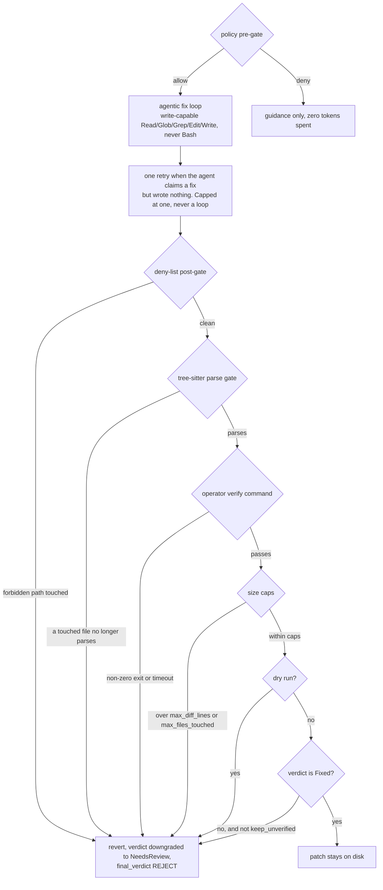
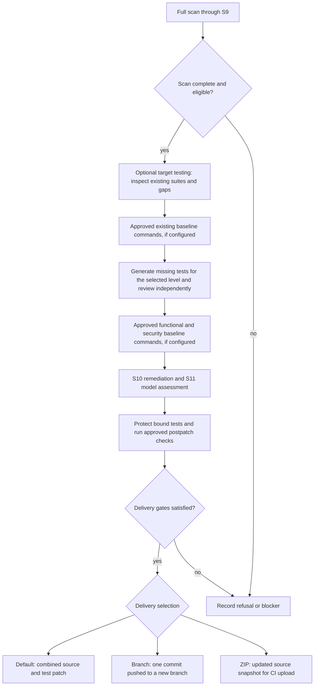

# The scan pipeline, S0 to S11

`bc_orchestrator::run_scan` sequences the detection pipeline. It knows only
stage *order*, degrade handling and early stop, and delegates rendering to S9.
Remediation (S10) and validation (S11) are separate phases behind
`--remediate`, not steps of `run_scan`.

**S9 is reporting.** It redacts the typed `FinalReport` from S8 and renders
Markdown and SARIF directly, without another model call or Markdown parsing.
The CLI publishes those artifacts and CSV/JSON exports. `--stop-after s8`
returns analysis without publishing reports; `--stop-after s9` publishes
reports and stops before remediation.

## Detection and reporting: S0 through S9

### What each stage consumes and produces

| Stage | Consumes | Produces | Off switch |
|---|---|---|---|
| **S0** `s0-seed` | repo root | `SeedPackage`, holding entry points, framework entry points with `reachable_from_unauth`, unsafe sinks, taint paths, taint evidence, call graph, def spans, file inventory | `step0.enabled` |
| **S1** `s1-preprocess` | repo root, known CVEs, design controls, changed files, `SeedPackage` | `ContextPackage` | not skippable; exploration skippable via `step1.mode: gap_fill` |
| **S2** `s2-threatmodel` | `ContextPackage`, on-disk docs and manifests, app profile | `ThreatModel`, attached to `ctx` | `step2.enabled`; also silently becomes `None` on any error |
| **S3** `s3-decompose` | `ContextPackage`, no raw code | `TaskManifest`: chunks plus unreachable files | not skippable |
| **S4** `s4-deepdive` | chunks, `ContextPackage` | `Finding` candidates, per-chunk outcomes | not skippable |
| **S5** `s5-prefilter` | candidates, `ContextPackage` | survivors plus `DroppedFinding`s | not skippable |
| **S6** `s6-verify` | survivors, `ContextPackage` | verified findings plus drops | not skippable |
| **S7** `s7-dedup` | verified findings | canonical findings plus duplicate drops | tiers individually toggleable |
| **S8** `s8-chain` | canonical findings, drops, raw count, metrics | `FinalReport` | **not skippable, and runs even after a budget stop** |
| **S9** `s9` | `FinalReport` | redacted report, Markdown and SARIF; CLI publishes exports | `--stop-after s8` stops before reporting |
| **S10** | a built `FinalReport` | `RemediationRun` | opt-in `--remediate` |
| **S11** | a finding plus its remediation record | `ValidationScore` | `step_validate.enabled` |

## The budget gate

One `SpendCap` with two independently-tripping fields: `--max-tokens` and
`--max-scan-seconds`. Both unset by default, in which case nothing ever
trips.

The distinction that matters: a **`--stop-after` stop** returns no report at
all. A **budget stop** falls through to the S8 tail with whatever is on hand,
and every candidate that never reached the verifier is recorded as
`Unconfirmed` with a detail beginning `"not verified"`, never as a
confirmed finding, and never silently dropped.

The report says so out loud, in `## Scan Health`:

> ⚠️ **BUDGET REACHED**: {reason}. The scan stopped starting new work at
> that point; findings from the work not done are absent, and any finding
> listed as not verified was never sent to the verifier.

The motivating incident is recorded in the code. A Juice Shop run rendered
160 unverified S4 candidates as 160 true positives at "100% precision",
which the code calls "the one thing this report must never do."

## S5's deterministic gates

Applied in a strict first-match-wins chain, so **a finding is dropped by at
most one gate**. Every rejection is recorded as a `DroppedFinding` with a
reason and a human-readable detail. Nothing is dropped silently.

Gates 5 and 6 run last **because they are the only ones that read from
disk**. A finding the cheap gates already rejected never costs a file read.

The two language gates are deliberately one-directional: they only ever drop
a finding whose language rules make it *impossible*, and every ambiguity
(an unreadable file, an unknown extension, a construct that might be in a
script or URL context) resolves to *keep*.

| Gate | Drops | Measured effect |
|---|---|---|
| **Event-loop gate** | a CWE-362 race claim on JS/TS code with no suspension point in a ±2-line window. `await` and `.then` are boundaries; a bare `async` keyword is not; a callback counts only if its callee is on an allowlist | Juice Shop race false positives fell from **16** to **8** |
| **Template auto-escape gate** | an XSS finding on a construct the template engine escapes by default, in HTML text or attribute context. Vetoed inside `script` or `style`, in a `javascript:` URL, in an inline event handler, in CSS context, or on a dangerous attribute, checked per construct, not per window | JSX/TSX and Angular are deliberately excluded: `{expr}` is not distinguishable by regex |
| **Route gate** | see [`guard-gate.md`](guard-gate.md) | n/a |

## S7's dedup tiers

Tier 0's sort keys, in order: sink-anchoredness, file, `line_start`,
severity, `vuln_class`, **CWE rank** (a specific CWE beats an umbrella one
such as CWE-20 or CWE-200), verdict confidence, S4 confidence, title. The
CWE key sits deliberately *before* the confidence keys, because model
confidence flips between runs and was observed flipping a finding's identity
between two runs of the same commit.

Tier 2 runs **after** tier 1, and that ordering is load-bearing: tier 1's
matches are the higher-confidence ones, so letting them claim their
canonicals first means the same-range pass can only ever join clusters that
nothing else explained. It collapsed **20-23 duplicate findings per run** on
Juice Shop: 11 findings for 3 near-identical functions in one file, filed
under four different CWEs on the same lines.

S5 runs tiers 0-2 too, before verification, because every lens collapsed
pre-verify is a whole multi-turn agentic S6 session that never has to happen.

## S10's safety gates

S10 treats the agent's edits as **a proposal that must earn the right to
stay**. Everything the agent writes is journalled with its pre-edit bytes
first, so a rollback is exact and works on a non-git target.

Details that are easy to get wrong:

- **The parse gate runs *after* the deny-list gate on purpose**, so a
  deny-listed path that also got mangled keeps its compliance audit trail
  rather than being reported as a mere syntax error.
- **Size caps are measured over everything *touched*, not just what the
  agent admitted to**, so an under-reported rewrite cannot slip the cap.
  Defaults: 200 diff lines, 1 file.
- **Dry run reverts but keeps the diff**, so PR fix suggestions still work.
- **The verdict gate exists because a half-applied fix is worse than no
  fix**: it looks addressed. `Not Fixed`, `Partially Fixed`, `Needs Review`
  and `False Positive` all revert unless `--keep-unverified`.
- The legacy operator verify command **executes a host shell command**.
  Its string is operator-configured, but the command can execute hostile
  target code. Target-testing mode rejects it and uses separately approved
  isolated execution instead.
- **A rolled-back finding is never checkpointed**, so `--resume` re-attempts
  it rather than skipping past a fix that is not on disk.

## S11 validation

A two-persona panel by default (`security-architect` and
`penetration-tester`, run concurrently) grading an S10 fix against four
weighted gates. A third, `cross-repo-analyzer`, is opt-in. The personas get
a **read-only** executor, never the write-capable one S10 used.

| Gate | Weight | Critical |
|---|---|---|
| `root_cause` | 0.43 | **yes** |
| `instance_coverage` | 0.2467 | no |
| `no_new_vulnerabilities` | 0.1867 | **yes** |
| `security_best_practices` | 0.1366 | no |

A critical gate that is skipped or garbled makes the whole result
`Unverifiable`; either critical gate being unclean caps the verdict below
`Fixed` regardless of the numeric score. A `Skip` leaves a gate out of the
denominator; an `Invalid` scores 0.0 and **stays in** it, so a garbled report
drags the score down rather than vanishing. Thresholds: `Fixed` at 0.80,
`PartiallyFixed` at 0.50.

A `NotFixed` or `Unverifiable` verdict reverts the patch using S10's
byte-exact baseline, while protecting files a *later* finding's kept patch
also touched.

## Full-scan target tests and delivery

Without target testing, eligible remediation proceeds directly to S10/S11.
The shipped testing levels never execute target code: baseline and postpatch
commands require a vetted embedded execution profile. Generation and model
review alone do not establish a passing suite. Branch and ZIP modes require
a full scan and explicit delivery selection; ZIP uses an isolated source
snapshot without requiring Git. See [target testing](../target-testing.md)
and [remediation delivery](../remediation-delivery.md).
