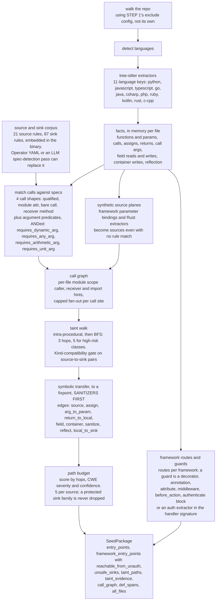
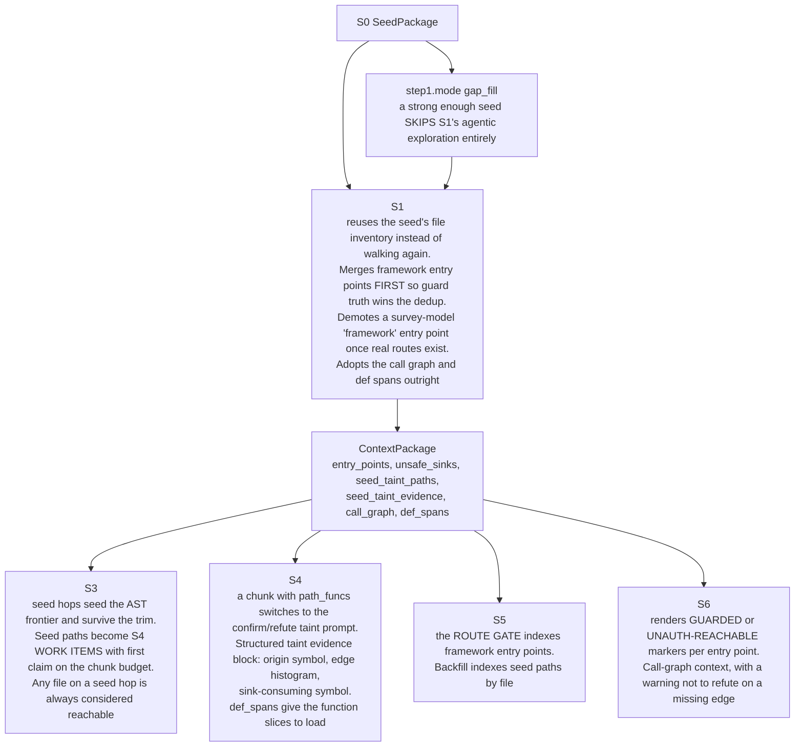

# The seed plane: step 0

S0 is the deterministic half of the scanner. It reads the repository with
tree-sitter, matches a bundled source/sink corpus, builds a call graph, walks
taint through it, and discovers framework routes and their auth guards. No
model is involved in any of that. The one optional LLM call in S0 chooses
*which* source/sink specs to match; the walk itself is LLM-free.

Turn it on or off with `step0.enabled`, which is on by default. Mode is
`step0.callgraph_detection`: `rules` (zero tokens) or `llm`.

It is worth what it costs. On the OWASP Juice Shop backend, seed plane off
versus on, same commit family: **1313 s down to 428 s**, **6.40M down to
4.56M tokens**, verification precision **69.8% up to 76.6%**, the cap
tripped before S7 in the first run and not in the second, and both hit the
same 14 of 15 canonical challenge files. It is not a detection aid so much
as a *targeting* aid: it spends static analysis to avoid spending model
calls.

## Inside S0

### The parts that are easy to get wrong

**"Correct scope" is a real bug that was fixed.** S0 has no exclusion config
of its own. The orchestrator overwrites its walk config with step 1's at
scan time. It has to, because S1 *reuses the seed's file inventory* when one
is present. A step-0 walk that ignored `step1.exclude_dirs` therefore
silently widened the entire scan: one Juice Shop run went from 199 files to
744 that way and spent its whole budget before verification. Configure
exclusions once, under `step1`.

**The soft gate.** A call-graph-reachable, kind-compatible source/sink pair
is emitted as a taint path *unless* the walk positively proves it reaches the
sink sanitized. An *ungrounded* walk keeps its path with fallback evidence.
This inverts the Python original's hard `if evidence is None: continue`,
which had the perverse effect of giving the best-understood languages the
fewest seed paths.

**Two extractor tiers.** Python, JavaScript, TypeScript, Go, Java and C#
get full extractors with assignment, return and call-argument facts, so
they have an interprocedural taint plane. PHP, Ruby, Kotlin, Rust and C/C++
use "lite" extractors: function definitions, call edges, params, indexed
request reads, and per-argument shapes. That last part is not a lesser
answer: all five judge which arguments are static string literals (for
`requires_dynamic_arg`), and C/C++ additionally judges which are
arithmetic and which are the literal `1`, which is what the allocation
rules need. Those shapes are read straight off the argument node kinds, so
a rule carrying a predicate is as precise here as under the full visitor.
What a lite extractor does not have is assignment, return and
call-argument facts, so no interprocedural taint evidence. That difference
is visible in the polyglot results.

**`entry_points` and `framework_entry_points` are separate fields on
purpose.** Plain entry points are *source call sites*, and they always carry
`reachable_from_unauth: false`, because a source call site says nothing
about how a request reaches it. Only the framework plane computes that flag
from evidence. Keeping them apart lets S1 merge once; the Python original
appends the framework set twice and double-counts every route.

**Absence of a guard is what makes a route unauthenticated.** Nothing is
emitted when nothing is known. A method-level opt-out beats a method-level
guard, and any method-level verdict beats the enclosing class's.

## How the rest of the pipeline consumes it

`SeedPackage` crosses exactly one crate boundary, orchestrator to S1.
Every later stage reads the seed *through* the `ContextPackage` that S1
writes.

With the seed plane **off**, `seed_taint_paths` and `seed_taint_evidence`
are empty, so S3's taint promotion, S4's structured evidence block, S5's
route gate and S6's guard markers all go dark at once, and the entry-point
and sink lists come only from what the survey model happened to say. That is
the configuration the 1313-second Juice Shop run was in.
