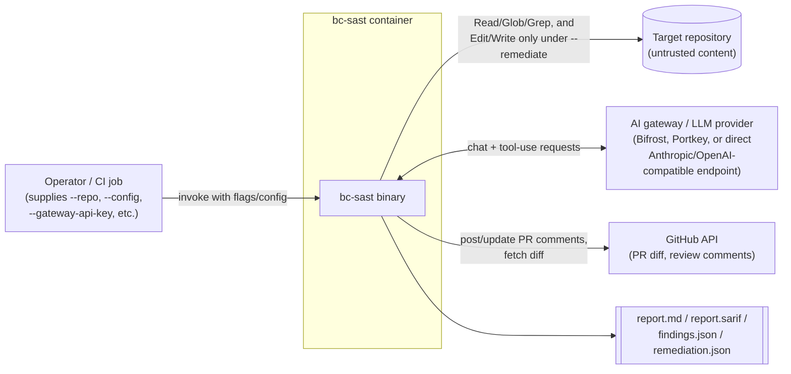
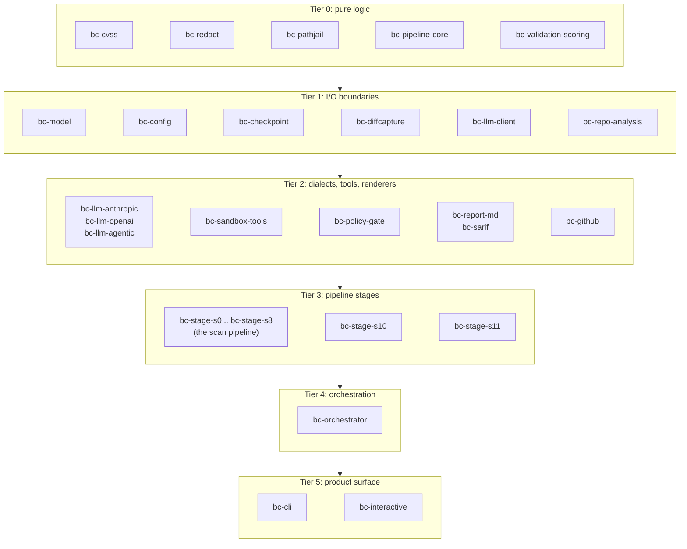
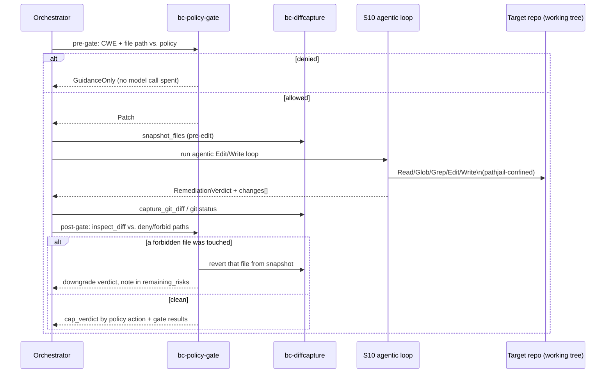
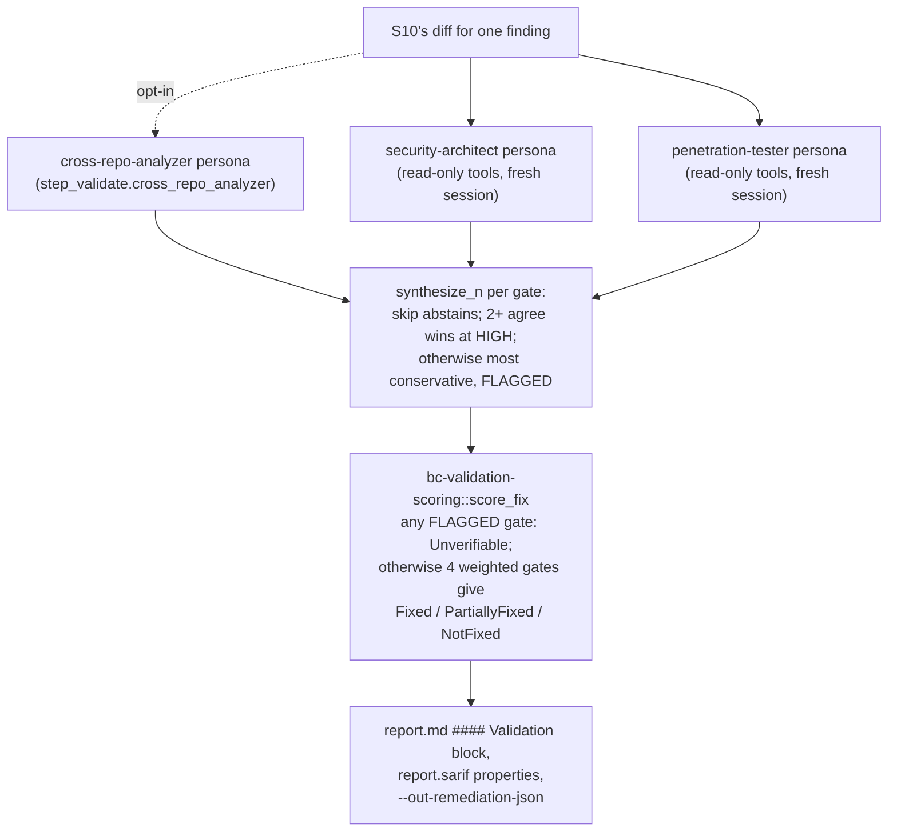
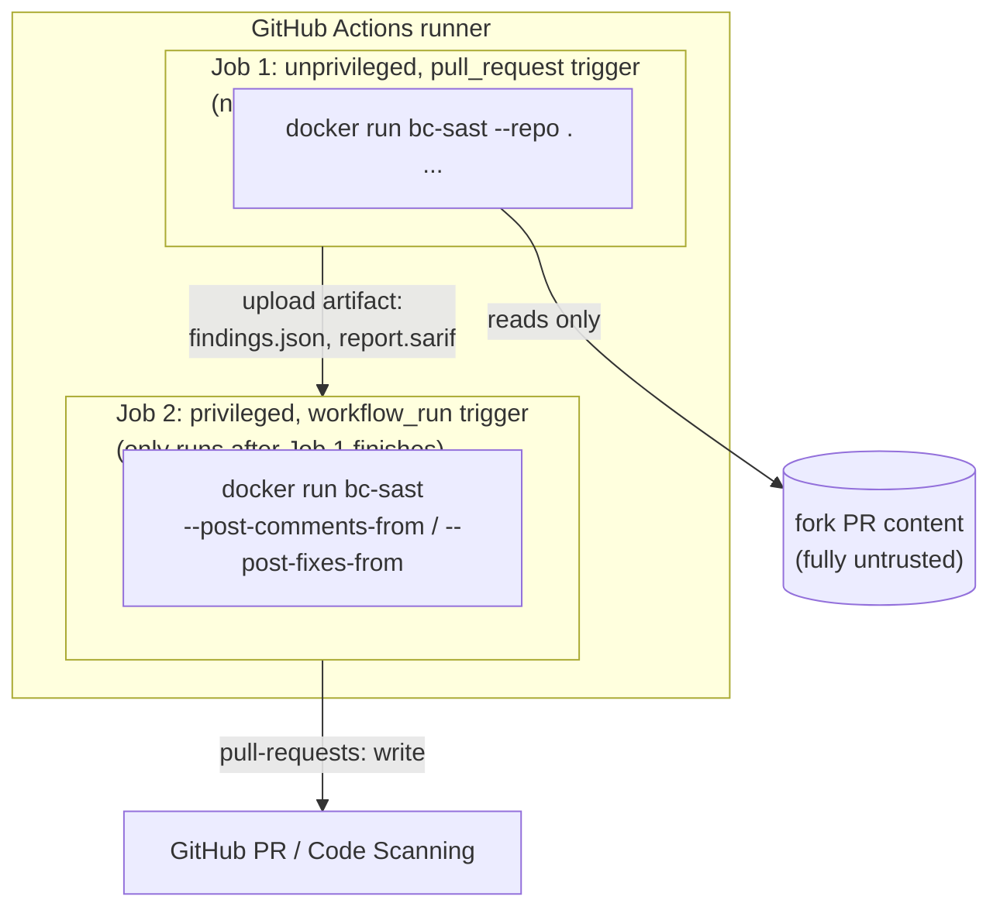
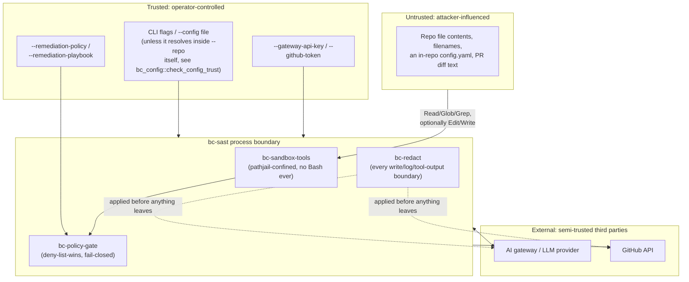

# Solution design

A single, diagram-led view of what BC Agentic SAST Harness (`bc-sast`) is,
how its pieces fit together, and why it's shaped the way it is. This is the
"what and why"; [`architecture.md`](architecture.md) is the detailed "how"
(exact crate list, per-stage degrade policy, cross-cutting concerns) and
this doc cross-references it rather than repeating it. An editable copy of
every diagram below also ships as [`diagrams/solution-design.drawio`](diagrams/solution-design.drawio)
(open at [diagrams.net](https://app.diagrams.net) or the draw.io desktop
app) for anyone who wants to adapt these diagrams outside Markdown/Mermaid.

## Purpose

`bc-sast` is an agentic SAST (static application security testing) scanner.
It points an LLM at a repository (or a PR diff), has it map the codebase,
build a threat model, hunt for vulnerabilities, adversarially verify its
own findings, rank severity, and optionally propose and grade remediations.
Output is a Markdown report, a SARIF file, and (optionally) GitHub PR
review comments with native suggested-fix diffs.

It is a Rust reimplementation of `vvaharness`, Visa's Apache-2.0 Python
agentic SAST harness. It contains no vvaharness Python source files, but it
does carry over a substantial amount of that project's own authored text
(the researcher hints and the stages' LLM prompts, chiefly), which remains
Copyright 2026 Visa, Inc. under Apache-2.0; see the root
[`README.md`](../README.md) and [`NOTICE`](../NOTICE) for the full
attribution and the per-file list. The pipeline stages, prompts, and
scoring logic are ported behavior-for-behavior, but the implementation is
this project's own.

## Goals

- Detect real vulnerabilities in arbitrary repositories via an LLM-driven
  agentic pipeline, with adversarial self-verification to suppress false
  positives before they reach a human reviewer.
- Optionally propose and apply fixes (remediation), then independently
  grade whether a fix actually worked (validation), without ever letting
  the validator be the same session that wrote the fix.
- Run anywhere a container can run: a laptop, a CI job, a GitHub Action,
  with no bundled model and no direct dependency on any one LLM vendor's
  SDK.
- Stay dialect-agnostic: one gateway-mediated `LlmClient` trait, two wire
  dialects (Anthropic Messages API, OpenAI-compatible Chat Completions),
  either able to point at a direct provider endpoint or an
  OpenAI/Anthropic-compatible AI gateway (Bifrost, Portkey, etc).
- Treat the scanned repository as hostile input throughout: every path,
  file, and piece of LLM output that originated from repo content is
  jailed, redacted, or policy-gated before it can affect the host,
  another file, or a human reader. See
  [`compliance/THREAT_MODEL_ATLAS.md`](compliance/THREAT_MODEL_ATLAS.md)
  for the systematic version of this claim.
- 100% line/function test coverage workspace-wide, with eleven crates plus
  one file held to their own slightly lower, individually documented
  thresholds (see
  [`coverage-exceptions.md`](coverage-exceptions.md)), plus a parity
  harness cross-checking scoring/redaction/config logic against the real
  Python original ([`parity-harness.md`](parity-harness.md)).

## Non-goals

- **Not a general application-security platform.** No dashboard, no
  finding-tracking database, no cross-repo correlation. One *scan* covers
  one repository (or PR) and produces file output plus optional PR
  comments. `--repo-file` batch mode walks a manifest, but each entry is an
  independent scan with no shared findings or call-graph context.
  Fleet-level aggregation is left to whatever CI/SARIF-consuming system
  already exists in an organization (GitHub code scanning, etc).
- **Target execution is an explicit extension.** Scan tools do not expose
  a shell. Full-scan remediation can use a vetted compiled testing profile
  to run target commands in restricted Linux containers. Shipped profiles
  do not execute tests. The legacy operator-configured host verification
  command is separate and is rejected for target testing and branch/ZIP
  delivery. See [target testing](target-testing.md).
- **Model review is not proof of a safe fix.** S11 grades the proposed
  change. Delivery gates use applicable review and test outcomes, but a
  successful result does not establish complete coverage or replace the
  target project's review and merge process.
- **Not model-hosting or model-training infrastructure.** `bc-sast` calls
  a configured gateway/endpoint for every LLM interaction; it never trains,
  fine-tunes, or hosts a model itself.

## System context

Who and what `bc-sast` talks to in a single invocation:

The operator is the only trusted input source (flags, config file, and the
gateway/GitHub credentials). Everything reachable through the target
repository (file contents, filenames, a checked-in `config.yaml`, a PR
diff) is treated as adversary-influenced. See
[`compliance/THREAT_MODEL_ATLAS.md`](compliance/THREAT_MODEL_ATLAS.md) for
what that means concretely per pipeline stage.

Config loading holds that line in three places (`bc-config`, see
[`configuration.md`](configuration.md)): a `--config` inside `--repo` is
refused unless `BC_ALLOW_CWD_CONFIG` is set; the implicit
`config.local.yaml` overlay is merged only when it is a regular file
owned by the invoking user or root and not group/world-writable; and a
secret-named `${VAR}` may not be interpolated into any config key, so a
shared profile cannot copy a token into a shell command such as
`step_remediate.verify_command`.

## Component view: crate tiers

`bc-sast` is a ~40-crate Cargo workspace, layered so each crate depends
only on a lower-or-equal tier (full list with responsibilities in
[`architecture.md`](architecture.md#workspace-layout)):

**Stage interfaces**: stages use the same
`PipelineStage` trait (`bc-pipeline-core`), so adding, removing, or
re-ordering a stage never touches unrelated code. Cross-cutting concerns
(redaction, path-jailing, CVSS scoring) are their own dependency-free
crates specifically so every consumer gets the identical, independently
tested behavior rather than N slightly-different inline copies.

## Pipeline data flow: scan (S0-S9) through remediation (S10) and validation (S11)

```mermaid
flowchart LR
    Repo[("repo +\nknown CVEs /\ndesign controls /\nCMDB app-id")] --> S0
    S0["S0 static seed\ntree-sitter, no LLM\nroutes / guards / taint"] --> S1
    S1["S1 preprocess\nagentic survey +\ncall graph"] --> S2["S2 threatmodel\nsingle-shot LLM"]
    S2 --> S3["S3 decompose\nrisk-ranked chunks,\n100% file coverage"]
    S3 --> S4["S4 deepdive\nN LLM calls/chunk,\nmajority vote"]
    S4 --> S5["S5 prefilter\ndeterministic gates\n+ pre-dedup"]
    S5 --> S6["S6 verify\nadversarial session\nTRUE/FALSE_POSITIVE + CVSS"]
    S6 --> S7["S7 dedup\ndeterministic +\nsemantic LLM pass"]
    S7 --> S8["S8 chain\nexploit chains,\nseverity re-rank"]
    S8 --> S9["S9 reporting\nredact and render, no model"]
    S9 --> Report[["report.md\nreport.sarif / report.csv"]]

    Report -.full scan with target testing.-> Tests["Discover existing suites\ngenerate and review missing tests"]
    Tests --> S10
    Report -.optional --remediate.-> S10["S10 remediate\npolicy-gated agentic\nEdit/Write loop"]
    S10 -.by default, if a diff exists.-> S11["S11 validate\n2-or-3-persona read-only\npanel + scoring"]
    S11 --> Delivery["Delivery gates\ncombined patch / new branch / source ZIP"]
    Delivery -.optional.-> PR["GitHub PR comments /\nsuggested-fix diffs"]
```

S0 runs by default and spends no tokens in its default `rules` mode; it
walks exactly S1's scope, so exclusions configured under `step1` bound both.
The framework routes and auth guards it extracts are what later let S5 drop
a "missing authorization" finding on a route the framework already guards,
and what S6's prompt reads as `[GUARDED]`/`[UNAUTH-REACHABLE]`.

Full per-stage degrade policy (what happens on a bad LLM response vs. a
failed call) is in [`architecture.md`](architecture.md), not repeated here
since it's implementation detail, not design.

Full-scan remediation can select compiled testing levels and deliver all
accepted source and test changes as a combined patch, one new branch, or a
source ZIP. Branch delivery uses a clean Git worktree. ZIP delivery scans
and edits the same isolated copy without requiring Git. These modes keep
the original source files unchanged and reject diff-scoped or incomplete
runs. See [built-in policies](built-in-policies.md),
[target testing](target-testing.md), and [delivery](remediation-delivery.md).

The editable draw.io diagrams predate these extensions; use this Markdown
flow and the linked implementation docs for the current execution paths.

## Remediation flow (S10) in detail

Every path an LLM verdict names is re-confined through `bc_pathjail::confine`
before it touches disk, never trusted as-is, even after the policy gate
allows the finding. Full mechanism in
[`remediation.md`](remediation.md).

## Validation flow (S11) in detail

The panel is two personas by default; `step_validate.cross_repo_analyzer:
true` adds a third that judges root cause and instance coverage from a
cross-component angle. Both (or all three) personas run **concurrently**
(independent, read-only, no shared mutable state to race on) and in a
conversation that never continues S10's own tool-calling session, a real
containment boundary against "the same injected content compromises both
the fix and its own grader." Full mechanism, weights, and thresholds in
[`validation.md`](validation.md).

## Deployment view

This two-workflow split exists because `bc-sast`'s `ToolExecutor` has no
network/shell capability of its own. The fork-analysis job never executes
anything from the fork and can therefore safely hold no elevated
permissions at all, while the privileged job that *can* post comments never
touches fork content directly (it only reads the first job's already-
computed JSON artifact). Full pattern and the two workflow YAML files in
[`github-action.md`](github-action.md).

The diagram above shows the **fork-PR-safe** shape, where the scanning job
must hold no write token. For same-repo PRs inside one organization, the
recommended deployment is simpler and is the primary story: build the image
once in CI, push it to a registry you control, and have each target repo's
`pull_request` workflow pull that image (ideally on a self-hosted runner,
so the environment is ephemeral and the gateway credential never leaves
your network), run the scan with `--diff-scope`, upload SARIF, and (with
`--pr-comments`, which is opt-in and requires `--diff-scope`) post or
reconcile PR comments. [`deployment.md`](deployment.md) is that guide.
Deployment infrastructure is not published here; the guide covers the registry
half only, not the way to deploy this.

Container build is `rust:1-slim-bookworm` + `cargo-chef`, producing a
nonroot (uid 65532) `cgr.dev/chainguard/wolfi-base` image with `git`
installed. Both stages are digest-pinned. glibc, not musl, because
`aws-lc-sys` resolves as a native C/C++ dependency via `reqwest`'s rustls
backend, so a pure-musl static build was not viable; the builder stays on
Debian bookworm because its older glibc produces a binary that runs on
both families. See [`architecture.md`](architecture.md) and the
`Dockerfile` itself for the full rationale, including why a security tool
ships a shell and a `git`: the `step_remediate.verify_command` gate needs
a shell to run the operator's build or test command, and the git revert
backstop, worktree isolation and HEAD-sha detection all need `git`. The
remediation agent's tool allowlist is Read, Glob, Grep, Edit and Write,
with no shell tool, so it cannot reach either. **Empirically build/run-tested**: the image builds and
runs a real scan (including `--remediate`) against a live PR under real
GitHub Actions triggers, and this repo's own `ci.yml` builds it (never
pushes) on every PR as a validation gate. See `github-action.md`'s
"Applying a suggested fix" section. `action.yml` itself, invoked as a
literal `uses:` action rather than a direct `docker build`/`docker run`,
has not yet been exercised in that exact form.

## Trust boundaries

The same system, redrawn around *what's trusted vs. what isn't*. This is
the load-bearing diagram for the threat model doc:

Note what does **not** appear in this diagram: there is no path from
`Untrusted` directly to `GW`/`GHAPI`/the host filesystem outside the jailed
repo tree that bypasses `Tools`/`Redact`/`Gate`. That absence is the
property being asserted, and
[`compliance/THREAT_MODEL_ATLAS.md`](compliance/THREAT_MODEL_ATLAS.md)
exists to test it systematically, tactic by tactic, rather than take it on
faith.

## Key design decisions

| Decision | Alternative considered | Why this way |
|---|---|---|
| Gateway-mediated `LlmClient` trait, two wire dialects | Direct per-vendor SDKs (Anthropic SDK, OpenAI SDK) | One trait, one agentic loop (`bc-llm-agentic::run_agentic`) written once and shared by every stage and dialect; provider keys never need to be vendor-SDK-shaped, and an operator's existing gateway (Bifrost, Portkey) works with zero code changes. |
| Jailed `ToolExecutor`, no `Bash` ever | Raw filesystem access, or a sandboxed shell | A host shell would defeat path-jailing outright on untrusted scan targets; `Read`/`Glob`/`Grep`(/`Edit`/`Write`) cover every real need without ever giving scanned content a way to run arbitrary commands. |
| ~40 single-responsibility crates | One monolithic binary crate | Each `PipelineStage` is independently testable/replaceable; cross-cutting concerns (redact, pathjail, CVSS) are single sources of truth instead of N inline copies that could drift apart. |
| Deterministic policy gate (`bc-policy-gate`), not an LLM-judged one | Ask the remediation model itself whether a patch is "safe" | CWE/path allow-deny logic is plain Rust, which makes it auditable, unit-tested, and not subject to the same prompt-injection surface as the thing it's meant to constrain. |
| S11 validation: fresh conversation, read-only tools | Continue S10's own session to grade its own fix | Structural containment against "the same injected content compromises both the fix and its own grader". Imperfect (the diff itself still passes through), but a real, verified boundary. |
| Checkpoints always *written*, only *read* under `--resume` | Resume automatically whenever a checkpoint exists | Both the scan pipeline (`ScanConfig::checkpoint`/`resume`, per-stage keys `s1`..`s7`; S0 has none, since it spends nothing to re-run) and S10 remediation (per-finding, keyed by `finding_identity`) persist their progress to the same SQLite store, so an interrupted scan or remediation can be resumed rather than re-spending its tokens. Reading is opt-in because a silently-resumed run is the worse default: a stale checkpoint from a since-changed working tree would look exactly like a fast scan. |

## Where to go next

- [`deployment.md`](deployment.md), on how to actually roll this out: build
  once, publish to your own registry, scan on pull request.
- [`architecture.md`](architecture.md): the detailed crate map and
  per-stage degrade policy this doc deliberately doesn't repeat.
- [`USER_GUIDE.md`](USER_GUIDE.md) / [`configuration.md`](configuration.md):
  how to actually run it and configure it.
- [`remediation.md`](remediation.md) / [`validation.md`](validation.md):
  full S10/S11 mechanism detail.
- [`compliance/THREAT_MODEL_ATLAS.md`](compliance/THREAT_MODEL_ATLAS.md):
  a systematic MITRE ATLAS threat model built directly on the trust
  boundary diagram above.
- [`compliance/AI_AGENT_SECURITY_REVIEW.md`](compliance/AI_AGENT_SECURITY_REVIEW.md)
  / [`compliance/CONTROL_MAPPING.md`](compliance/CONTROL_MAPPING.md): gap
  analysis against OWASP LLM Top 10 / AARM, and ASVS/SSDF/PCI-DSS/PCI-SSF
  control mapping.
